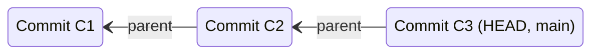
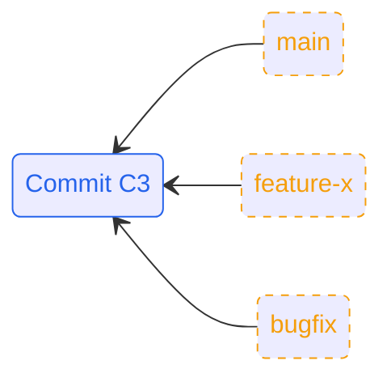
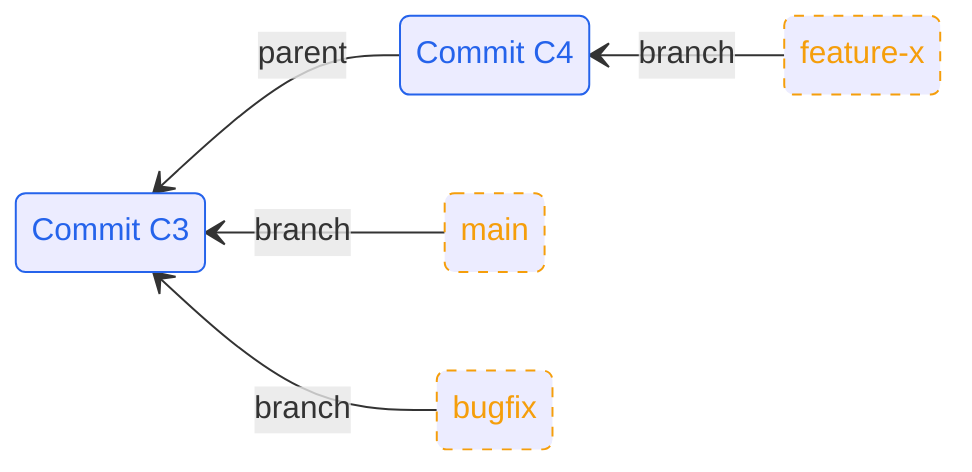

# Git in Practice  
## Techniques for Collaborative Development

---
hideInToc: true
--- 
## Contents
<Toc columns=2 maxDepth=1>
</Toc>

---

# Why Git Hurts in Teams

- Works great on solo projects

<!-- Git is easy alone, hard together -->

---

- Becomes painful with multiple developers

---

## Common Pain Points When Working in a Team

- Messy, unreadable commit history
- Long-lived branches that never merge cleanly
- Merge conflicts nobody understands
- Fear of breaking `main`

---

## What This Talk Is About

- Not Memorizing commands
- Not Git internals trivia
- Learning how to work in a team <strong> *safely* </strong>

---

# How Git Actually Works
## (Mental Model)

<!-- commmit as a change set (not strictly true, but makes things simple) -->

---
src: ./pages/commit.md
---

---

---

<h2 class="mb-4">Branches Are Just Pointers</h2>

- A branch is just an extra piece of metadata that gets passed along from parent to child 
- No copies, no magic 
- Multiple branches can point to the same commit

<!-- branches arent folders -->

---

## Squashing Strategies
- Squash before merge
- Squash during rebase 
- Squash in GitHub/GitLab
- Just dont squash
<!-- Sam: if commits just undo previous commits then would squash  
Telling the useful story -->

---

# Conflicts Happen 
## Don't panic

---

## Why conflicts occur 
- Parallel changes to the same lines
- Formatting tools
- Long-lived branches

---

## Tools that can help 
- IDE merge tools 
- `git mergetool`

---

# Scaling beyond the individual
## Automation and Reviews 

---

## Git Hooks 
- pre-commit 
- commit-msg

---

## CI/CD Integration
- Tests on every push 
- As enforcement  

---

## Code Reviews
- Small MR/PRs 
- Clear intent 
- History cear 

---

# Exercise overview 
WHATEVER THIS MAY BE

---

# Practical Rules to take away 
- Rebase your own 
- Merge together
- Keep PRs small
- Write (published) commits for everyone else/future you

<!-- Git is a communication tool and its the history that tells the story -->
