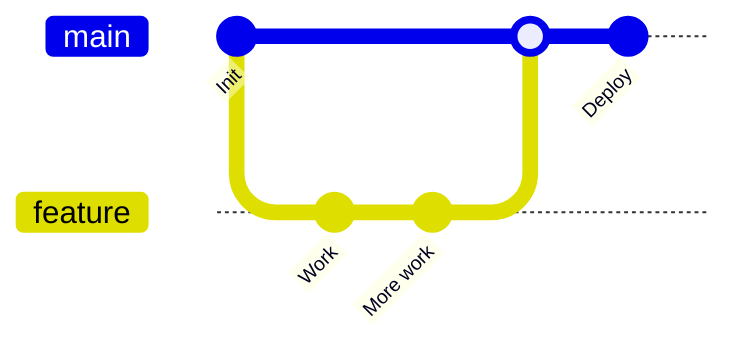
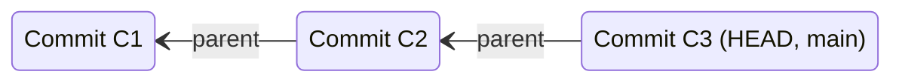
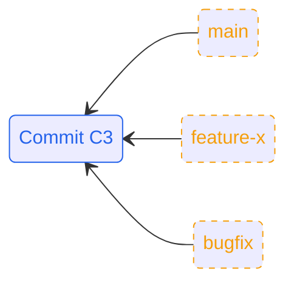
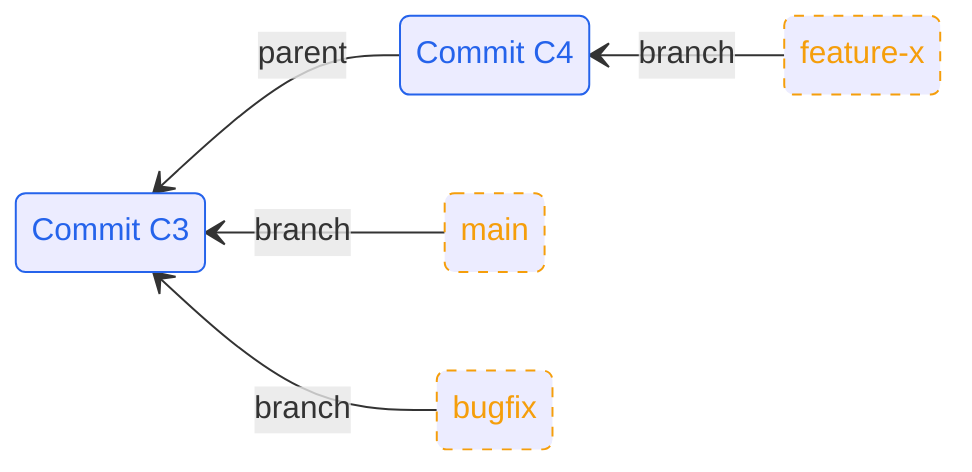
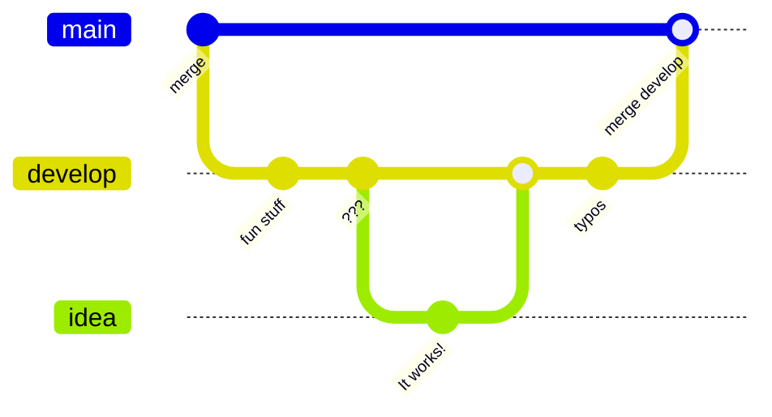
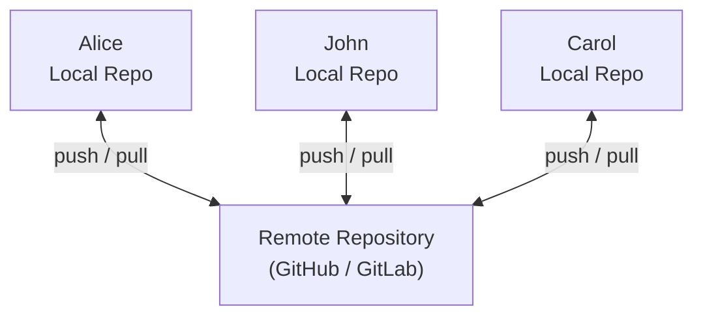
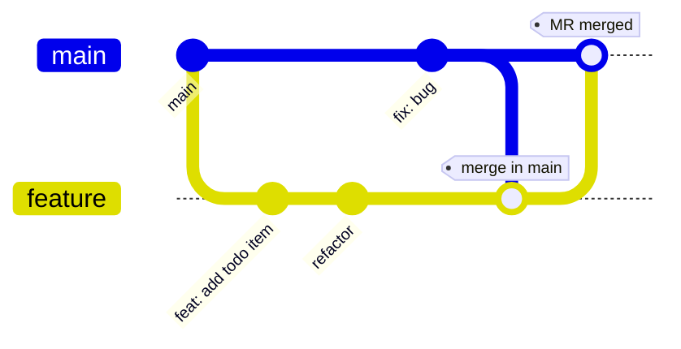

# Git in Practice  
## Techniques for Collaborative Development

---
hideInToc: true
--- 
## Contents
<!-- <Toc columns=2 maxDepth=1>
</Toc> -->

---
layout: cover
---

# Why Git Hurts in Teams

---
layout: two-cols
---

::left:: 


# The Solo Experience

<v-clicks>

 - Linear history
 - Zero conflicts
 - Total control 
</v-clicks>

::right:: 

<div v-click class="bg-white/5 p-4 rounded-lg shadow-xl">
<p class="text-xs mb-2 font-mono">This is what we expect</p>
<div class="scale-90 origin-top">



</div>
</div>

---
layout: default
---

# The Team Reality

<div class="grid grid-cols-3 gap-4">
<v-clicks class="col-span-1">

- You are 4 commits ahead
- John force-pushed his hotfix
- Richard's refactor has been approved
- Nobody has pulled in 3 days

</v-clicks>

<div v-click class="col-span-2 transition-all duration-500">

</div>
</div>

<div v-click class="absolute inset-0 flex items-center justify-center bg-red-900/80 backdrop-blur-sm rounded-lg border-4 border-red-500 animate-shake">
<div class="text-center">
  <carbon-warning-alt-filled class="text-6xl mb-2" />
  <h2 class="text-white">CONFLICT</h2>
  <p class="font-mono text-xs">CONFLICT (content): Merge conflict in EVERYTHING.ts</p>
</div>
</div>

---
layout: two-cols
---

::left:: 

<h2 class="mb-4">
Common Pain Points When Working in a Team
</h2>

<v-clicks>

- A messy, unreadable commit history
- Long-lived branches that never merge cleanly
- Merge conflicts nobody understands
- Fear of breaking `main`
</v-clicks>

::right::

<div class="relative w-full">
  <div v-click v-show="$clicks <= 5" >
    <BadGitHistory />
  </div>
  <div v-click v-show="$clicks > 5" >
    <Merge />
  </div>
</div>

---
layout: default
class:
---

# Sounds familiar?

<SoundsFamiliar/>

---
layout: cover
---

# How Git Actually Works

<!-- commmit as a change set (not strictly true, but makes things simple) -->


---
src: ./pages/commit.md
---

---

<div class="h-full flex justify-center items-center scale-300">



</div>

---

<div class="grid grid-cols-2 gap-6">
<div>


<h2 class="mb-4">Branches Are Just Pointers</h2>
<v-clicks>

- A branch is just an extra piece of metadata that gets passed along from parent to child 
- No copies, no magic 
- Multiple branches can point to the same commit

</v-clicks>
<br/>
<div v-click="5">

- `git checkout feature-x`
- `git commit `
</div>
</div>
<div>
<div v-click="4">


</div>
<div v-click="6">



</div>
</div>
</div>

<!-- branches arent folders -->

---
layout: two-cols-header
---

<div class="mb-1">

## `git branch`
<p class="opacity-50 mt-2">Even when you're working solo</p>

</div>

::left::

<v-clicks>

- To separate your work from the `main` branch 
- It's harder for unstable code to get merged into the main code base
- Gives you a chance to clean up your future git history before merging it into the main branch

- Make a new branch when you:
  - Make a new feature 
  - Fix a bug
  - Just experiment

</v-clicks>

::right:: 

<v-click>


</v-click>

<div v-click class="p-2 mt-2 border border-red-500/30 bg-red-500/10 rounded text-md font-bold flex items-center justify-center flex-shrink">
  <carbon-close-filled class="ma-1 text-red-500"/>

Never commit to `main`
</div>

<!-- Okay maybe it is fine to commit to main if  
- Solo projects with discipline
- Tiny obvious changes (README, config)
- True emergency hotfixes
- -->

---
layout: cover
---

# Conflicts Happen 
## Don't panic

---
layout: default
---

# Creation of a conflict

<Conflicts />

---
layout: default
---

# The Best Way to Prevent Conflicts
<p class="opacity-50 -mt-2 mb-8">Stop them from happening in the first place</p>

<div class="grid grid-cols-3 gap-4">

<div v-click class="p-4 rounded-xl border border-blue-500/20 bg-blue-500/5">
  
<h3 class="font-bold mb-1 flex items-center"> <carbon-paint-brush class="text-blue-400 text-3xl mb-1 mr-2" />Consistency</h3>

- Have a standard:
  - quotation marks
  - indentation
  - white space
  - import order
  - variable names
  - ...

</div>

<div v-click class="p-4 rounded-xl border border-green-500/20 bg-green-500/5">
  
<h3 class="font-bold mb-1 flex items-center"> <carbon-bot class="text-green-400 text-3xl mb-1 mr-2" />Automation</h3>

- Enforce some standards using linters

```js
//from eslint.config
stylistic: {
  indent: 2,
  quotes: 'single',
},
```

- The diff will only show logic changes
- Enforce those linters with git-hooks or CI/CD pipelines

</div>

<div v-click class="p-4 rounded-xl border border-purple-500/20 bg-purple-500/5">

<h3 class="font-bold mb-1 flex items-center">
<carbon-chat class="text-purple-400 text-3xl mb-1 mr-2" />
 Teamwork</h3>

- **Communicate**
- Small, atomic PRs
- Culture changes:
  - `git pull` and `git rebase` frequently
  - `git fetch` is a friend 

</div>
</div>

---

## Tools that can help resolve conflicts

- IDE merge tools 
- `git mergetool`

---
layout: cover
---

--- 
layout: cover
class:
---

# How Teams Use Git
## Collaboration Workflows 

<!-- - Depends very much on numerous things: 
  - Infrastructure vs software 
  - Length of time it takes for CI to run  -->

<!-- ---
layout: two-cols-header


<div class="mb-2">

## Remotes: the original model
</div>

::left::
- Everyone had their **own remote**  
- You pushed and pulled from *each other*

This is where “pull request” comes from

→ “I have pushed to my remote, please pull my changes”


- As you can imagine - this doesnt scale well


::right:: 

put bad image here  -->

---
layout: two-cols-header
---
<div class="mb-8">

## How do teams use Git
</div>

::left::
- Each developer works in a **local Git repository** on their own machine
- Changes are committed **locally** first
- A **shared remote repository** (GitHub / GitLab) is used to:
  - Share work
  - Integrate changes
  - Review code
- The  `main` branch on the remote is often treated as the **source of truth**

::right::

---
layout: default
---
<div class="mb-8">

## Git Workflows
</div>
<div class="grid grid-cols-2 gap-4">
<v-clicks>
<div class="bg-blue-500/10 p-4 rounded-lg border-2 border-blue-400/10">

* **Centralised:** 
  * Everyone pushes to `main`
  * Fast, but works best in small teams

</div>
<div class="bg-green-500/10 p-4 rounded-lg border-2 border-green-400/10">

* **Trunk-Based:** 
  * Small, frequent commits to `main` 
  * High speed, requires good testing and CI.

</div>
<div class="bg-purple-500/10 p-4 rounded-lg border-2 border-purple-400/10">

* **Git Flow:** 
  * Rigid, multi-branch system
  * Great for scheduled releases, but *heavy*
  * Not recommended anymore
  
</div>
<div class="bg-orange-500/10 p-4 rounded-lg border-2 border-orange-400/10">

* **Forking:** 
  * Total isolation
  * Common in Open Source where you don't trust everyone with "write" access.

</div>

</v-clicks>
</div>
<v-click>
<div class="bg-yellow-500/10 p-4 rounded-lg border-2 border-yellow-400/10 mt-4">

**Feature Branching** balances safety (code reviews) with speed (parallel work).

</div>
</v-click>
---
layout: two-cols-header
---

<div class="mb-6">

## A Typical Feature Branch Workflow with a Remote
</div>

::left::

```bash {1-3|5-7|9-10|12-13|15-16|18-21|all}
git checkout main
git pull origin main # update main
git checkout -b feature # create your branch

# Work locally
git add files
git commit -m "feat: add new todo item"

git fetch origin # update your local version of main
git merge origin/main # (or rebase, depending on team)

# Push your branch to the remote
git push origin feature

# Open a merge request / pull request
# Review → approve → merge

# Update your local main after merge
git checkout main
git pull origin main
# Your changes are visible!

```

::right:: 
<div class="ml-2">
<v-clicks > 



**Why this works:**
- Isolation: Bad code merged? main stays functional
- Collaboration: Push triggers a Pull Request — discussion
- Clean History: Merging back to main only happens once the code is "Done-Done"

</v-clicks>
</div>
---

## Pull Requests Fit *On Top*

- PRs are a collaboration layer
- Not a workflow by themselves
- History quality affects review quality

---

## Squashing Strategies
- Squash before merge
- Squash during rebase 
- Squash in GitHub/GitLab
- Just dont squash
<!-- Sam: if commits just undo previous commits then would squash  
Telling the useful story -->

---
layout: cover
---


# Git Power Tools and How to Use Them
## Without Breaking Things


---
layout: two-cols-header
src: pages/reset.md
---

---
layout: default
---

## `git reflog`

<span class="opacity-50 mt-2">The annoying truth-telling brother of `git log` 
</span>

<div class="grid grid-cols-2 gap-2">
<div class="">
<div class="text-red">

`git log`
</div>

<div v-if="$clicks <= 2" v-click>

- Shows the current HEAD and where it has been
- It prints the commit HEAD points to, then its parent, its parent, and so on.

</div>
<div v-click="3">

```bash
commit e6edcdc (HEAD -> main, new-branch)
Author: Lizzie Salmon <lizzie.salmon@stfc.ac.uk>
Date:   Tue Feb 3 15:47:03 2026 +0000

    feat: Add to do

commit f6e25d1
Author: Lizzie Salmon <lizzie.salmon@stfc.ac.uk>
Date:   Mon Feb 2 17:12:44 2026 +0000

    feat: new file (dont delete this)

commit 9479df0
Author: Lizzie Salmon <lizzie.salmon@stfc.ac.uk>
Date:   Mon Feb 2 17:11:40 2026 +0000

    feat: Initial To Do list

```
</div>

</div>

<div>

<div class="text-red">

`git reflog`
</div>

<div v-if="$clicks <= 2" v-click="2" >

- Shows an ordered list of the commits that HEAD has pointed to
- It's a fully comprehensive history for your *local* repo
- It means that nothing is permanently lost EVER

</div>
<div v-click="4">

```bash
e6edcdc (HEAD -> main, new-branch) HEAD@{0}: merge new-branch: Fast-forward
f6e25d1 HEAD@{1}: checkout: moving from new-branch to main
e6edcdc (HEAD -> main, new-branch) HEAD@{2}: commit (amend): feat: Add to do
191f995 HEAD@{3}: commit: Add to do
f6e25d1 HEAD@{4}: checkout: moving from main to new-branch
f6e25d1 HEAD@{5}: reset: moving to f6e25d1
9479df0 HEAD@{6}: reset: moving to HEAD~1
f6e25d1 HEAD@{7}: commit: feat: new file (dont delete this)
9479df0 HEAD@{8}: commit (initial): feat: Initial To Do list

```
</div>
</div>
</div>


---
layout: two-cols-header
---


<div class="mb-4">

## `git reflog` saving the day
</div>

::left::


```bash {all|1-2|4-6|7-9|10-12|13-17|18-20|21-24}
$ git commit -m "feat: Initial To Do list"
[main 9479df0] feat: Initial To Do list

$ git commit -m "feat: new file (dont delete this)"
[main f6e25d1] feat: new file (dont delete this)

$ git reset --hard HEAD~1 # <--- disaster has struck!! 
HEAD is now at 9479df0 feat: Initial To Do list

$ git log --oneline
9479df0 (HEAD -> main) feat: Initial To Do list

$ git reflog
9479df0 HEAD@{0}: reset: moving to HEAD~1
f6e25d1 HEAD@{1}: commit: feat: new file (dont delete this)
9479df0 HEAD@{2}: commit (initial): feat: Initial To Do list

$ git reset --hard HEAD@{1}
HEAD is now at f6e25d1 feat: new file (dont delete this)

$ git log --oneline
f6e25d1 (HEAD -> main) feat: new file (dont delete this)
9479df0 feat: Initial To Do list
```

::right::

<div class="m-2">

<div v-click="5" class="text-sm">

- `9479df0`  is the 7-character short SHA of the commit.


- `HEAD@{2}:` explains that this is the second prior position of the head

  - `@{0}` is the current position of the head
  - `@{1}` is the previous step
- `commit` / `checkout` / `reset`
  - This is the action that caused the move

</div>
</div>


<div v-click="6" class="p-3 bg-blue-500/10 rounded border-l-4 border-blue-500 m-2">
<div class="text-sm leading-tight">
  <b>Tip:</b> 
  You can also use time-based notation: 

- `main@{yesterday}`
- `HEAD@{5.minutes.ago}`
</div>
</div>
---
layout: default
---

## Beyond undoing `reset`
<div class="opacity-50 -mt-2 mb-8 text-sm">

When `git log` can't tell you what happened, `git reflog` can.
</div>

<div class="grid grid-cols-3 gap-4">

  <div v-click class="p-4 rounded-xl border border-orange-500/20 bg-orange-500/5">

  <!--  -->
  <h3 class="font-bold mb-1 flex items-center"> <carbon-branch class="text-orange-400 text-2xl" /> Deleted Branch</h3>

  <div class="text-sm opacity-80 flex-grow">
    You finished a feature, merged it, and <b>deleted the branch</b>. 
    Suddenly, you realize you missed a file. 
  </div>
  <!-- <div class="mt-4 font-mono text-xs bg-black/40 p-2 rounded text-orange-200">
    $ git reflog<br>
    <span class="opacity-50">... checkout: moving from feature to main</span><br>
    <b>f6e25d1</b> HEAD@{1}: commit: ...
  </div> -->
  </div>

  <div v-click class="p-4 rounded-xl border border-blue-500/20 bg-blue-500/5">
  <h3 class="font-bold mb-1 flex items-center"> <carbon-direction-merge class="text-blue-400 text-2xl" /> Messy Rebase</h3>
  <div class="text-sm opacity-80">
    
  You rebased your branch onto `main`, but you messed up the conflict resolution and the code is now broken.
  </div>
  <!-- <div class="mt-4 font-mono text-xs bg-black/40 p-2 rounded text-blue-200">
    <span class="opacity-50">// Find the state BEFORE rebase</span><br>
    $ git reset --hard HEAD@{15}
  </div> -->
  </div>

  <div v-click class="p-4 rounded-xl border border-purple-500/20 bg-purple-500/5">

  <h3 class="font-bold mb-1 flex items-center"><mdi-ghost-outline class="text-purple-400 text-2xl" />Lost Amend</h3>
  
  <div class="text-sm opacity-80">
  
  You used `git commit --amend` to fix a typo, but accidentally overwrote a bunch of good code in the process.
  </div>
  <!-- <div class="mt-4 font-mono text-xs bg-black/40 p-2 rounded text-purple-200">
    <span class="opacity-50">// Reflog keeps the "pre-amend" hash</span><br>
    $ git cherry-pick b1c2e3f
  </div> -->
  </div>

</div>
<div v-after class="p-4 text-center rounded-xl border border-purple-500/20 bg-pink-500/5 mt-4">
    If you saw it on your screen once, it's in the reflog.
</div>
---

## `git cherry-pick`
- Apply a specific commit elsewhere
- Great for quick fix
- Dangerous when overused

---

## `git rebase`
- Applying lots of cherry-picks at once 

---

## `git bisect`
- underused! 
  
---

# Shaping History Intentionally
## Branching, Merging, Rebasing

---

## Merge: Preserving History

- Keeps all branches visible
- Shows when work diverged
- Can create noisy graphs

<!-- Diagram slide -->

---

## Rebase: Rewriting History

- Replays commits on a new base
- Creates linear history
- Changes commit hashes

<!-- Diagram slide -->

---

## Rebase vs Merge

- Merge: record *what happened*
- Rebase: show *what you want others to see*

> Rebase your own work.  
> Merge shared work.

---

## Interactive Rebase

- Reorder commits
- Squash commits
- Edit commit messages

---

# Practical Rules to take away 
- Rebase your own 
- Merge together
- Keep PRs small
- Write (published) commits for everyone else/future you

<!-- Git is a communication tool and its the history that tells the story -->
