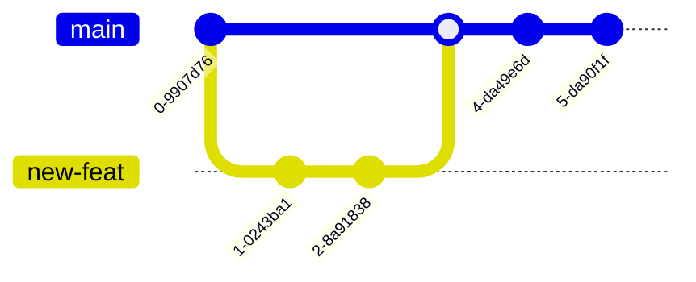
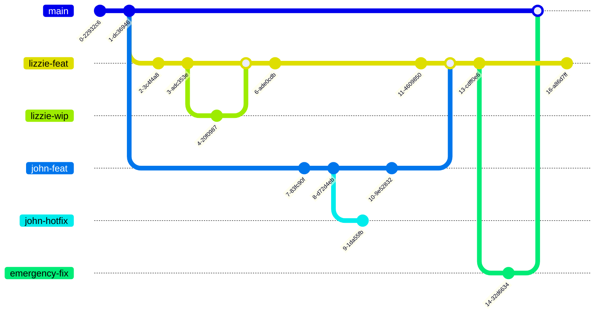

# Git in Practice  
## Techniques for Collaborative Development

---
hideInToc: true
--- 
## Contents
<Toc columns=2 maxDepth=1>
</Toc>

---

# Why Git Hurts in Teams

- Works great on solo projects


<!-- Git is easy alone, hard together -->

---

- Becomes painful with multiple developers



--- 

## Common Pain Points When Working in a Team

- Messy, unreadable commit history
- Long-lived branches that never merge cleanly
- Merge conflicts nobody understands
- Fear of breaking `main`

---

## What This Talk Is About

- Not Memorizing commands
- Not Git internals trivia
- Learning how to work in a team <strong> *safely* </strong>

---

# How Git Actually Works
## (Mental Model)


<!-- commmit as a change set (not strictly true, but makes things simple) -->

---

## Commits Are Basis

- A commit is a snapshot
- Each commit points to a parent
- History forms a **graph**, not a line

For the sake of this talk we will be treating commits as a change set 
Essentially the outcome of a git diff 

<!-- Diagram slide -->

---

## Branches Are Just Pointers

- A branch = movable label
- No copies, no magic
- Multiple branches can point to the same commit

---

## HEAD and Your Position

- `HEAD` = where you are now
- Detached HEAD explained briefly
- Why this matters for rebase/reset

---

## How does git merge 

--- 

## Where do conflicts come from

---

## Why This Model Matters

- Explains merges and rebases
- Explains conflicts
- Explains “dangerous” commands

<!-- Git only feels dangerous when the model is missing -->

--- 

# Power Tools (Without Breaking Things)
## Advanced Commands with Escape Plans

---

## `git reset`
- `--soft`
etc 
- which bits move (HEAD Index Workign Tree) Make sure that these are defined

--- 

## `git reflog`

---

## `git cherry-pick`
- Apply a specific commit elsewhere
- Great for quick fix
- Dangerous when overused

---

## `git rebase`
-- Applying lots of cherry-picks at once 

--- 

## `git bisect`
- underused! 
  
---

# How Teams Organize Change
## Collaboration Workflows

- Depends very much on numerous things: 
  - Infrastructure vs software 
  - Length of time it takes for CI to run 

--- 

## Using remotes
- Initially (before gitlab github) everyone would have their own remote
- Push and pull to each others
- Where the term "pull request" came from. 


---

## Feature Branch Workflow

- One branch per change
- Pull / merge requests
- Pros: isolation, review
- Cons: long-lived branches

---

## Trunk-Based Development

- Short-lived branches
- Frequent integration
- Heavy use of CI
- Pros: fewer conflicts
- Cons: requires discipline

---

## Gitflow (Briefly)

- `develop`, `release`, `hotfix`
- Popular historically
- Often too heavy 
- Designed to solve problems that are not so big anymore 
<!-- Releases used to be ~2 years, now two weeks ish (the problem that it was designed to fix) -->

---

## Pull Requests Fit *On Top*

- PRs are a collaboration layer
- Not a workflow by themselves
- History quality affects review quality

---

## Other tools to help teams that could be a whole talk

- Merge queue
- Linters and formatting checkers to remove conflicts
  
---


# Shaping History Intentionally
## Branching, Merging, Rebasing

<!-- Having good git history is really useful - being able to jump anywhere and run tests  -->
> Git history is nothing but air


---

## Merge: Preserving History

- Keeps all branches visible
- Shows when work diverged
- Can create noisy graphs


---

## Rebase: Rewriting History

- Replays commits on a new base
- Creates linear history
- Changes commit hashes


---

## Rebase vs Merge

- Merge: record *what happened*
- Rebase: show *what you want others to see*

> Rebase your own work.  
> Merge shared work.

---

## Interactive Rebase

- Reorder commits
- Squash commits
- Edit commit messages
- fixup (This is a new feature)

```bash
git rebase -i HEAD~5
```

--- 

## Squashing Strategies
- Squash before merge
- Squash during rebase 
- Squash in GitHub/GitLab
- Just dont squash
<!-- Sam: if commits just undo previous commits then would squash  
Telling the useful story -->

--- 


---

# Conflicts Happen 
## Don't panic

--- 

## Why conflicts occur 
- Parallel changes to the same lines
- Formatting tools
- Long-lived branches

--- 

## Tools that can help 
- IDE merge tools 
- `git mergetool`

--- 

# Scaling beyond the individual
## Automation and Reviews 

---

## Git Hooks 
- pre-commit 
- commit-msg

--- 

## CI/CD Integration
- Tests on every push 
- As enforcement  

--- 

## Code Reviews
- Small MR/PRs 
- Clear intent 
- History cear 

--- 

# Exercise overview 
WHATEVER THIS MAY BE

--- 

# Practical Rules to take away 
- Rebase your own 
- Merge together
- Keep PRs small
- Write (published) commits for everyone else/future you

<!-- Git is a communication tool and its the history that tells the story -->

--- 