<div class="h-full">

<div class="bg-purple-900 w-full py-2 px-2">

<div class="flex flex-row">
<h1>
Git in Practice
</h1>
<h2 class="mt-8 ml-2">
 Techniques for Collaborative Development
</h2>
</div>

### Lizzie Salmon 
### ICSC 2026

</div>


</div>

<!-- We all know why we use git -->

---
layout: section
---

<sectionTitle colour="green-900">

# Why Git Hurts in Teams
</sectionTitle>


---
layout: two-cols-header
---


<slideTitle colour="green-900">

## The Solo Experience
</slideTitle>


::left:: 


<v-clicks class="ml-4">

 - Linear history
 - Zero conflicts
 - Total control 
</v-clicks>

::right:: 

<div v-click class="p-4 rounded-lg shadow-xl">
<p class="text-xs mb-2 font-mono">This is what we expect</p>
<div class="scale-90 origin-top">

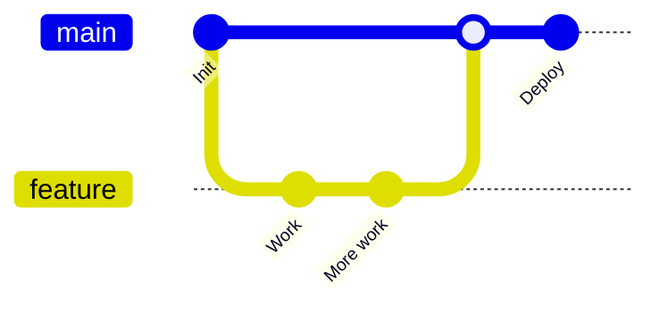
```mermaid
gitGraph
  commit id: "Init"
  branch feature
  checkout feature
  commit id: "Work"
  commit id: "More work"
  checkout main
  merge feature
  commit id: "Deploy"
```

</div>
</div>

---
layout: default
---
<slideTitle colour="green-900">

## The Team Reality
</slideTitle>

<div class="grid grid-cols-3 gap-4 ml-4">
<v-clicks class="col-span-1">

- You are 4 commits ahead
-  [J Robert](https://en.wikipedia.org/wiki/J._Robert_Oppenheimer) force-pushed his hotfix
- [Rosalind](https://en.wikipedia.org/wiki/Rosalind_Franklin)'s refactor has been approved
- Nobody has pulled in 3 days

</v-clicks>

<div v-click class="col-span-2 transition-all duration-500">
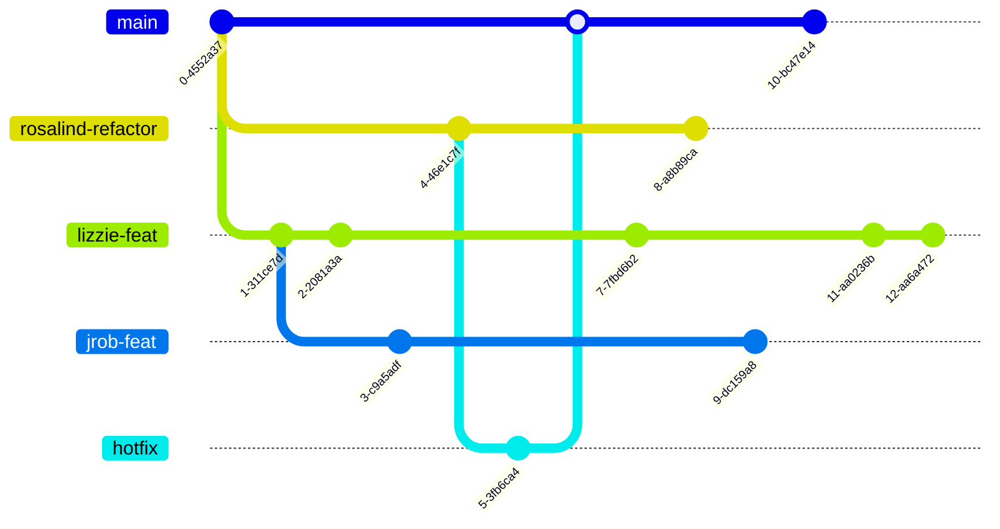
```mermaid
gitGraph
  commit
  branch rosalind-refactor
  branch lizzie-feat
  checkout lizzie-feat
  commit
  branch jrob-feat
  checkout lizzie-feat
  commit
  checkout jrob-feat
  commit
  checkout rosalind-refactor
  commit
  branch hotfix
  checkout hotfix
  commit
  checkout main
  merge hotfix
  checkout lizzie-feat
  commit
  checkout rosalind-refactor
  commit
  checkout lizzie-feat
  checkout jrob-feat
  commit
  checkout main
  commit
  checkout lizzie-feat
  commit
  commit 
```
</div>
</div>

<div v-click class="absolute inset-0 flex items-center justify-center bg-red-900/80 backdrop-blur-sm rounded-lg border-4 border-red-500 animate-shake">
<div class="text-center">
  <mdi-alert class="text-6xl mb-2" />

  ## CONFLICT
  <p class="font-mono">CONFLICT: Merge conflict in EVERYTHING.ts</p>
</div>
</div>

---
layout: two-cols-header
---

<slideTitle colour="green-900">

## Common Pain Points When Working in a Team
</slideTitle>

::left:: 

<br>
<v-clicks class="ml-4">

- A messy, unreadable commit history
- Long-lived branches that never merge cleanly
- Merge conflicts nobody understands
- Fear of breaking `main`
</v-clicks>

::right::

<div class="flex flex-shrink">
  <div v-click v-show="$clicks <= 5" >
    <BadGitHistory />
  </div>
  <div v-click v-show="$clicks > 5" >
    <Merge />
  </div>
</div>

---
layout: default
hideInToc: true
---
<slideTitle colour="green-900">

## Sounds Familiar?
</slideTitle>


<SoundsFamiliar class="mx-4"/>

---
layout: section
---
<sectionTitle colour="sky-800">

# Basic Git Commands
</sectionTitle>

## Understanding Git teminology

---

<slideTitle colour="sky-800">

## Git Areas
</slideTitle>

<div class="grid grid-cols-2 gap-6 px-8 mt-8">

  <div v-click class="border border-slate-500  p-6 rounded-2xl ">
    <h3 class="text-xl font-semibold mb-4  text-sky-300">
      Working Directory
    </h3>
    <ul class="opacity-90">
      <li>Where you write your code</li>
      <li>Real files on disk</li>
      <li>Not versioned yet</li>
    </ul>
  </div>

  <div v-click class="border border-slate-500  p-6 rounded-2xl ">
    <h3 class="text-xl font-semibold mb-4  text-sky-300">
      Staging Area
    </h3>
    <ul class="opacity-90">
      <li>The “prepare” zone</li>
      <li>Select what goes into the next commit</li>
      <li>Controlled by <code>git add</code></li>
    </ul>
  </div>

  <div v-click class="border border-slate-500  p-6 rounded-2xl ">
    <h3 class="text-xl font-semibold mb-4  text-sky-300">
      Local Repository
    </h3>
    <ul class="opacity-90">
      <li>Your local history</li>
      <li>Fully versioned</li>
      <li>Updated by <code>git commit</code></li>
    </ul>
  </div>

  <div v-click class="border border-slate-500  p-6 rounded-2xl ">
    <h3 class="text-xl font-semibold mb-4  text-sky-300">
      Remote Repository
    </h3>
    <ul class="opacity-90">
      <li>Shared version on a server</li>
      <li>Updated by <code>git push</code></li>
      <li>Downloaded via <code>git fetch</code></li>
    </ul>
  </div>

</div>

---

<slideTitle colour="sky-800">

## Git Areas
</slideTitle>

<div class="flex justify-center items-center h-95% scale-295">

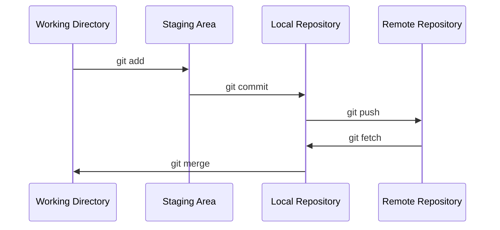
```mermaid
sequenceDiagram
    participant WD as Working Directory
    participant SA as Staging Area
    participant LR as Local Repository
    participant RR as Remote Repository

    WD->>SA: git add
    SA->>LR: git commit
    LR->>RR: git push

    RR->>LR: git fetch
    LR->>WD: git merge
```

</div>

<div v-click class="absolute bottom-40 left-2 bg-sky-500 px-6 py-4 rounded-sm text-lg border-t-4 border-sky-800 -rotate-2">

`git pull` == `git fetch` + `git merge`
</div>

<!--
make it just of a reminder that the staging area exists, nothing leaves local repo until it is pushed

If you like sequence diagrams
-->

---
layout: two-cols-header
src: ./pages/commit.md
hideInToc: true
---

---

<slideTitle colour="sky-800">

## Branches as Pointers
</slideTitle>

<div class="grid grid-cols-2 gap-6 mx-2 h-90%">


<div>
<v-clicks>

- A branch is just a tag that gets passed along from parent to child 
- No copies, no magic 
- Multiple branches can point to the same commit

</v-clicks>
<br>
<div v-click="5">

  `git switch feature-x`

  `git commit`
</div>


<div v-click="7" class="absolute bottom-0 left-3 -rotate-3">
  <div class="bg-sky-700 p-4 border-t-4 border-sky-500 w-100 flex flex-col items-center justify-center text-center">
    
`git switch` is the recommended way to change between branches.  

It works just like `git checkout` but is used **only** for changing branches.
  </div>
</div>


</div>
<div class="flex flex-col justify-around">
<div v-click="4">
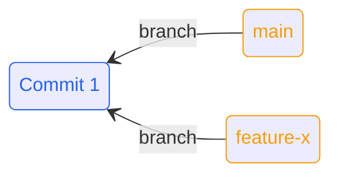
```mermaid
stateDiagram-v2
  direction RL

  state "Commit 1" as C1

  state "main" as main
  state "feature-x" as fx

  main --> C1 : branch
  fx --> C1 : branch

  %% Styling
  class main,fx branch
  class C2,C1 parent

  classDef branch stroke:#f59e0b,color:#f59e0b
  classDef parent stroke:#2563eb,color:#2563eb
```

</div>
<div v-click="6">


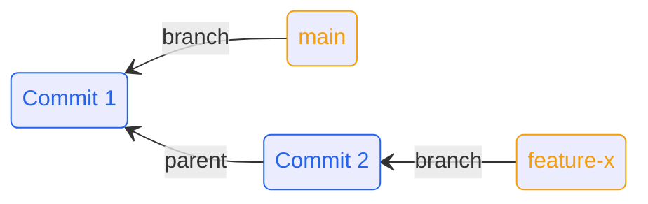
```mermaid
stateDiagram-v2
  direction RL

  state "Commit 1" as C1
  state "Commit 2" as C2

  state "main" as main
  state "feature-x" as fx

  

  %% Branch pointers (dashed, colored)
  main --> C1 : branch
  fx --> C2 : branch

  C2 --> C1 : parent

  %% Styling
  class main,fx branch
  class C2,C1 parent

  classDef branch stroke:#f59e0b,color:#f59e0b
  classDef parent stroke:#2563eb,color:#2563eb

```
</div>
</div>
</div>

<!-- branches arent folders -->


---

<slideTitle colour="sky-800">

## Panic Commands
</slideTitle>

<div class="grid grid-cols-8 mx-4">
<div class="col-span-5">

<v-clicks>

**Read-only** commands. Use them to avoid the "How did I get here?" panic

`git status`
- Shows the difference between your Working Directory, Staging Area, and the current `HEAD`
</v-clicks>

<div v-click="5">

`git log`
</div>

<div v-click="6">

- Lists the history of commits that lead to where you are now
</div>
<div v-click="7">

- `git log --oneline --graph`
</div>

<div v-click="8">
```bash
*   4ef9557 (HEAD -> main) Merge branch 'katherine/feat'
|\
| * a1b8571 (katherine/feat) fix: make more precise
* | f03a420 (thomas/feat) fix: pi is three
|/
* 0842057 feat: Initial commit
```
</div>


</div>

<div v-click="4" class="col-span-3 flex justify-center items-center">
<div class="bg-sky-600 pa-4 h-50 w-60 border-t-4 border-sky-800 rotate-2">

`HEAD` is a pointer to the current commit you’re working on

Usually, it points to the tip of your current branch
</div>
</div>
</div>


--- 
layout: section
---

<sectionTitle colour="teal-800">

# Using Git in Teams
</sectionTitle>

---
layout: two-cols-header
---

<slideTitle colour="teal-800">

## How Teams Use Remotes
</slideTitle>

::left::
<v-clicks class="mx-4">

- Each developer works in a **local Git repository** on their own machine
- Changes are committed **locally** first
- A **shared remote repository** (GitHub / GitLab) is used to:
  - Share work
  - Integrate changes
  - Review code
- The  `main` branch on the remote is often treated as the **source of truth**

</v-clicks>

::right::
<v-click>

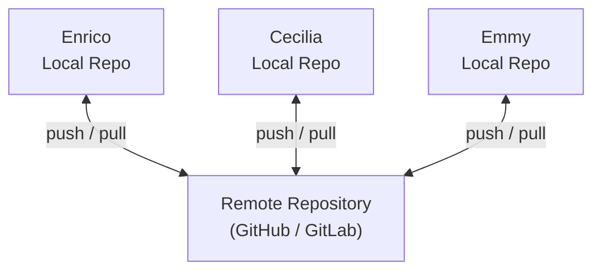
```mermaid
graph TD
  Remote["Remote Repository<br/>(GitHub / GitLab)"]

  DevA["Enrico<br/>Local Repo"]
  DevB["Cecilia<br/>Local Repo"]
  DevC["Emmy<br/>Local Repo"]

  DevA <-->|push / pull| Remote
  DevB <-->|push / pull| Remote
  DevC <-->|push / pull| Remote

```
</v-click>

<v-click>
<div class="absolute bottom-10 right-10 -rotate-3">
  <div class="bg-teal-700 p-6 border-t-4 w-80 border-teal-800 flex items-center justify-center text-center">
    This could be you working on an HPC cluster, or on another computer. 
  </div>
</div>
</v-click>


<div v-click="5" class="absolute bottom--2 right-15 text-sm text-gray-600" >

[Enrico](https://en.wikipedia.org/wiki/Enrico_Fermi),
[Cecilia ](https://en.wikipedia.org/wiki/Cecilia_Payne-Gaposchkin),
[Emmy](https://en.wikipedia.org/wiki/Emmy_Noether)
</div>

<!--
The linux kernel
-->

---
layout: default
---

<slideTitle colour="teal-800">

## Git Workflows
</slideTitle>

<div class="grid grid-cols-2 gap-4 ma-2">
<v-clicks>
<div class=" p-4 rounded-lg border-2 border-blue-400/10">

* **Centralised:** 
  * Everyone pushes to `main`
  * Fast, but works best in small teams

</div>
<div class=" p-4 rounded-lg border-2 border-green-400/10">

* **Trunk-Based:** 
  * Short-lived branches with few commits 
  * High speed, requires good testing and CI

</div>
<div class=" p-4 rounded-lg border-2 border-purple-400/10">

* **Git Flow:** 
  * Rigid, multi-branch system
  * Great for scheduled releases
  * Easy to roll back
  
</div>
<div class=" p-4 rounded-lg border-2 border-orange-400/10">

* **Forking:** 
  * Everyone owns a server-side repository
  * Common in Open Source - don't give everyone "write" access.

</div>

</v-clicks>
</div>
<v-click>
<div class="ma-2 p-4 rounded-lg border-2 border-yellow-400/10 mt-4 flex justify-center">

**Feature Branching** balances safety (code reviews) with speed (parallel work)

</div>
</v-click>

<!--
There are lots of different ways to use git - some formulated methods include the below

Git is actually really flexible

But people do it their own way
-->

---
layout: two-cols-header
---

<slideTitle colour="teal-800">

## Feature Branching
</slideTitle>

<div class="mx-2 mb-1">
Even when you're working solo or without a remote

</div>

::left::

<v-clicks class="mx-2">

- Separate your work from the `main` branch 
- It's harder for unstable code to be merged into the main branch
- Gives you a chance to clean up your future git history before merging it into the main branch

- Make a new branch when you:
  - Make a new feature 
  - Fix a bug
  - Just experiment

</v-clicks>

::right:: 

<v-click>
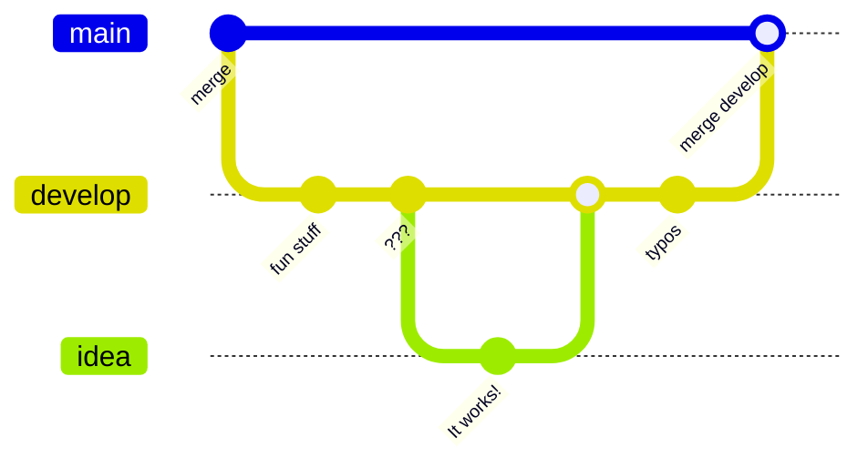
```mermaid
gitGraph
    commit id: "merge"
    branch develop
    checkout develop
    commit id: "fun stuff"
    commit id: "???"
    branch idea
    checkout idea
    commit id: "It works!"
    checkout develop
    merge idea
    checkout develop 
    commit id: "typos"
    checkout main
    merge develop id: "merge develop"
```

</v-click>

<div v-click class="p-2 ma-4 border border-red-500/30 bg-red-500/10 rounded text-md font-bold flex items-center justify-center flex-shrink">
  <carbon-close-filled class="ma-1 text-red-500"/>

Never commit to `main`
</div>

<!--
Separate changes that are unrelated

Okay maybe it is fine to commit to main if  
- Solo projects with discipline
- Tiny obvious changes (README, config)
- True emergency hotfixes
-
-->

---
layout: two-cols-header
---

<slideTitle colour="teal-800">

## A Typical Feature Branch Workflow with a Remote (Merge)
</slideTitle>

::left::

<div class="ml-4">

<div v-if="$clicks==1"> 

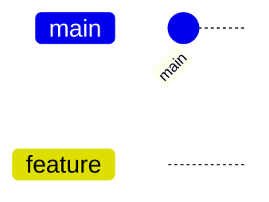
```mermaid
gitGraph
  commit id: "main"
  branch feature
  checkout feature
  
```
</div>

<div  v-if="$clicks==2"> 

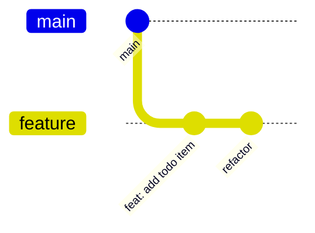
```mermaid
gitGraph
  commit id: "main"
  branch feature
  checkout feature
  commit id: "feat: add todo item"
  commit id: "refactor"
```
</div>

<div v-if="$clicks==3">

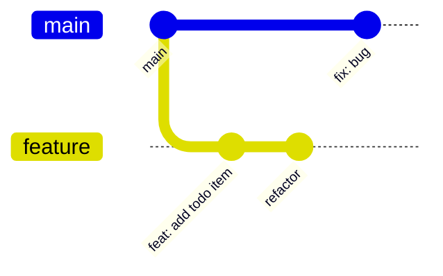
```mermaid
gitGraph
  commit id: "main"
  branch feature
  checkout feature
  commit id: "feat: add todo item"
  commit id: "refactor"
  checkout main
  commit id: "fix: bug"
  
```
</div>

<div v-if=" $clicks==4 || $clicks==5 || $clicks==6"> 

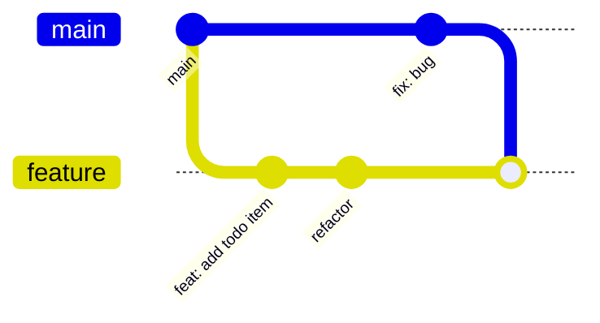
```mermaid
gitGraph
  commit id: "main"
  branch feature
  checkout feature
  commit id: "feat: add todo item"
  commit id: "refactor"
  checkout main
  commit id: "fix: bug"
  checkout feature
  merge main
  
```
</div>

<div v-if="$clicks==7"> 

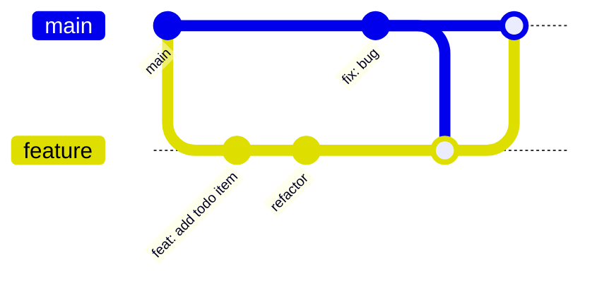
```mermaid
gitGraph
  commit id: "main"
  branch feature
  checkout feature
  commit id: "feat: add todo item"
  commit id: "refactor"
  checkout main
  commit id: "fix: bug"
  checkout feature
  merge main
  checkout main
  merge feature
```
</div>


<div v-click="6" class="col-span-3 flex justify-center items-center">
<div class="bg-teal-900 pa-2 h-50 w-60 border-t-4 border-teal-700 -rotate-2">

A merge/pull request is a way of saying to your team: 

“Please review and merge my changes into the main branch.”
</div>
</div>
</div>

::right:: 

<div v-if="$clicks >= 1" class="mx-2">

```bash {0|1-3|5-7|9|10|12-13|15-16|18-21}
git switch main
git pull # update main
git switch -c feature # create your branch

# Work locally
git add files
git commit -m "feat: add new todo item"

git fetch origin # update your local version of main
git merge origin/main # (optionally!)

# Push your branch to the remote
git push origin feature

# Open a merge request/pull request
# Review → approve → merge

# Update your local main after merge
git switch main
git pull
# Your changes are visible!

```

</div>

<!--
If you are on a busy project people may have pushed in between you resolving conflicts and merging - so some people just dont bother
-->

---
layout: default
---


<slideTitle colour="teal-800">

## Resolving Conflicts
</slideTitle>

<div class="grid grid-cols-2 mx-2">
<div>

We have three branches:

<v-clicks>

- `main` → current production logic (π ≈ 3.14)
- `thomas/feat` → quick fix (π ≈ 3)
- `katherine/feat` → using (`math.pi`)

</v-clicks>
</div>
<div>

<v-click>

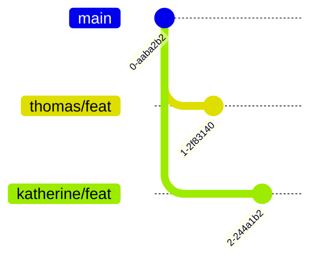
```mermaid
gitGraph
  commit
  branch thomas/feat
  branch katherine/feat
  checkout thomas/feat
  commit
  checkout katherine/feat
  commit

```
</v-click>
</div>
</div>

<div class="grid grid-cols-3 gap-2 mb-8 mx-2">

<div v-click>

On branch `main`

```python
def calculate_circumference(radius):
    return(2*3.14*radius)
```
</div>


<div v-click>

On branch `thomas/feat`
```python
def calculate_circumference(radius):
    return(2*3*radius)
```

</div>
<div v-click>

On branch `katherine/feat`
```python
def calculate_circumference(radius):
    return(2*math.pi*radius)
```
</div>
</div>

<div v-click="2" class="absolute bottom--2 right-15 text-sm text-gray-600" >

[Thomas](https://en.wikipedia.org/wiki/Thomas_Edison),
[Katherine](https://en.wikipedia.org/wiki/Katherine_Johnson)
</div>
---

<slideTitle colour="teal-800">

## Resolving Conflicts
</slideTitle>

<div class="grid grid-cols-3 mx-2">
<div class="col-span-2">
<v-click>

```bash {1-2|1-}
# On branch main
lizzie:~/mergeConflicts$ git merge thomas/feat
Updating 68f5977..a76a9d8
Fast-forward
 circumference.py | 2 +-
 1 file changed, 1 insertion(+), 1 deletion(-) # This is a fast forward merge

```
</v-click>
<div v-click=4>
```bash
* 1568e33 (HEAD -> main, thomas/feat) fix: pi is three
* a12cd31 feat: Initial commit
```
</div>

<div class="mt-10" v-click="5">

```bash {all|1|1-}
lizzie:~/mergeConflicts$ git merge katherine/feat
Auto-merging circumference.py
CONFLICT (content): Merge conflict in circumference.py
Automatic merge failed; fix conflicts and then commit the result. 
```
</div>
</div>
<div v-click="3" v-show="$clicks===3">

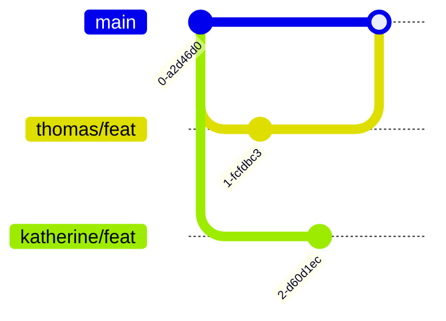
```mermaid
gitGraph
  commit
  branch thomas/feat
  branch katherine/feat
  checkout thomas/feat
  commit
  checkout katherine/feat
  commit
  checkout main 
  merge thomas/feat
```
</div>

<div v-click="4" v-show="$clicks===4">

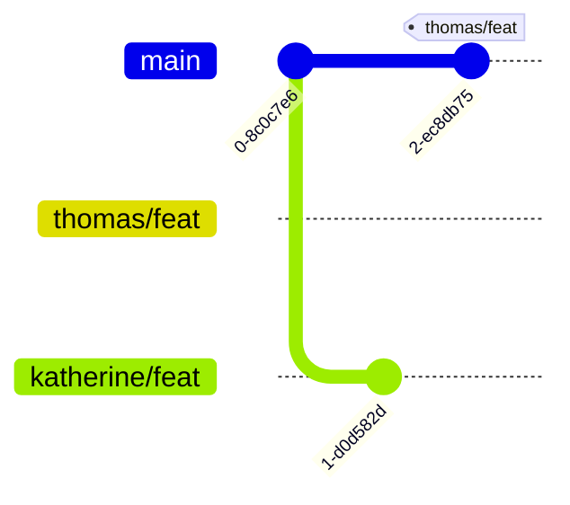
```mermaid
gitGraph
  commit
  branch thomas/feat
  branch katherine/feat
  checkout katherine/feat
  commit
  checkout main
  commit tag: "thomas/feat"
  checkout main 
  
```
</div>

</div>

<div class="absolute bottom--2 right-15 text-sm text-gray-600" >

[Thomas](https://en.wikipedia.org/wiki/Thomas_Edison),
[Katherine](https://en.wikipedia.org/wiki/Katherine_Johnson)
</div>

---
layout: default
---

<slideTitle colour="teal-800">

## Resolving Conflicts
</slideTitle>

<div class="grid grid-cols-2 gap-4 mx-2">
<div v-click>

open `circumference.py`

````md magic-move{at:2}
```python
def calculate_circumference(radius):
 <<<<<< HEAD
    return(2*3*radius)
=======
    return(2*math.pi*radius)
>>>>>>> katherine/feat
```
```python
def calculate_circumference(radius):
    return(2*math.pi*radius)
```
````

</div>
</div>

<div class="mx-2 grid grid-cols-2">
<div>

<v-clicks at="3">

`git add circumference.py`

`git commit`

`git log --oneline --graph`

```bash
*   4ef9557 (HEAD -> main) Merge branch 'katherine/feat'
|\
| * a1b8571 (katherine/feat) fix: make more precise
* | f03a420 (thomas/feat) fix: pi is three
|/
* 0842057 feat: Initial commit
```
</v-clicks>
</div>

<div v-click="7" v-show="$clicks===7">

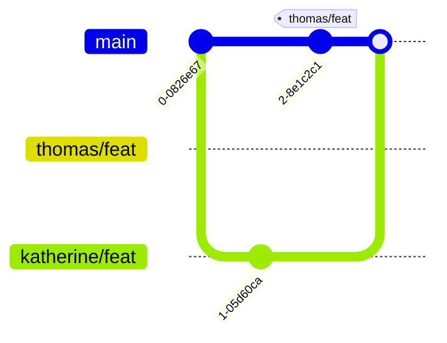
```mermaid
gitGraph
  commit
  branch thomas/feat
  branch katherine/feat
  checkout katherine/feat
  commit
  checkout main
  commit tag: "thomas/feat"
  checkout main 
  merge katherine/feat
```
</div>
</div>

<div class="absolute bottom--2 right-15 text-sm text-gray-600" >

[Thomas](https://en.wikipedia.org/wiki/Thomas_Edison),
[Katherine](https://en.wikipedia.org/wiki/Katherine_Johnson)
</div>

---


<slideTitle colour="teal-800">

## Surely there is a better way than that?
</slideTitle>

- git has its own selection of merge tools

`git mergetool --tool=vimdiff`

---

<div class="absolute bottom-1 scale-70">


</div>

---

<slideTitle colour="teal-800">

## Surely there is a better way than that?
</slideTitle>

- VSCode has its inline merge resolving


- It also has its own Merge Editor 

---
layout: default
---


<!-- Loads of other options too - inlcluding meld which is free -->
---


<slideTitle colour="teal-800">

## The Best Way to Prevent Conflicts
</slideTitle>
<p class="mt-2 mb-8 mx-2">Stop them from happening in the first place</p>

<div class="grid grid-cols-3 gap-4 mx-2">

<div v-click class="p-4 rounded-xl border border-blue-500/20 bg-blue-500/5">
  
<h3 class="font-bold mb-1 flex items-center"> <carbon-paint-brush class="text-blue-400 text-3xl mb-1 mr-2" />Consistency</h3>

- Have a standard:
  - quotation marks
  - indentation
  - white space
  - import order
  - variable names

</div>

<div v-click class="p-4 rounded-xl border border-green-500/20 bg-green-500/5">
  
<h3 class="font-bold mb-1 flex items-center"> <carbon-bot class="text-green-400 text-3xl mb-1 mr-2" />Automation</h3>

- Enforce some standards using linters

```js
//from eslint.config
stylistic: {
  indent: 2,
  quotes: 'single',
},
```

- The diff will only show logic changes
- Enforce those linters with git-hooks or CI/CD pipelines

</div>

<div v-click class="p-4 rounded-xl border border-purple-500/20 bg-purple-500/5">

<h3 class="font-bold mb-1 flex items-center">
<carbon-chat class="text-purple-400 text-3xl mb-1 mr-2" />
 Teamwork</h3>

- **Communicate**
- Small, atomic PRs
- Culture changes:
  - `git pull` and `git rebase` frequently
  - `git fetch` is a friend 

</div>
</div>


---
layout: section
---
<sectionTitle colour="pink-900">

# Changing History
</sectionTitle>


## without breaking things


<v-click>
<div class="absolute bottom-10 right-3 -rotate-3">
  <div class="bg-pink-700 pa-4 border-t-4 border-pink-800 w-70 flex items-center justify-center text-center">

`HEAD~3` refers to the commit three steps before `HEAD`, found by traversing back through its parent commits.
  </div>
</div>
</v-click>
---

<slideTitle colour="pink-900">

## `git commit --amend`
</slideTitle>
<div class="mx-2">

Instead of creating a **new** small "typo" commit, you update the previous one.
</div>

<div class="grid grid-cols-2 gap-4 mt-4 text-left mx-2">
<div v-click class="bg-gray-500/5 p-4 rounded border border-white/10">
<h3 class="text-purple-400 mb-2">Scenario A: Fix the Message</h3>
You just want to change the text.

`git commit --amend -m "New better message"`
</div>
<div v-click class="bg-gray-500/5 p-4 rounded border border-white/10">
<h3 class="text-pink-400 mb-2">Scenario B: Add Files</h3>
You forgot to add a file.

`git add forgotten-file.ts`

`git commit --amend --no-edit`

(`--no-edit` keeps the existing message)
</div>
</div>


---
layout: two-cols-header
---
<slideTitle colour="pink-900">

## `git cherry-pick` 
</slideTitle>

::left:: 

<v-clicks class="mx-2">

- Selects a **single commit**
- Applies its changes elsewhere
- Does **not** move the original commit
</v-clicks>

<div v-click="5" class="mx-2">

`git switch feature`

`git cherrypick abcde`
</div>

::right:: 

<v-click>

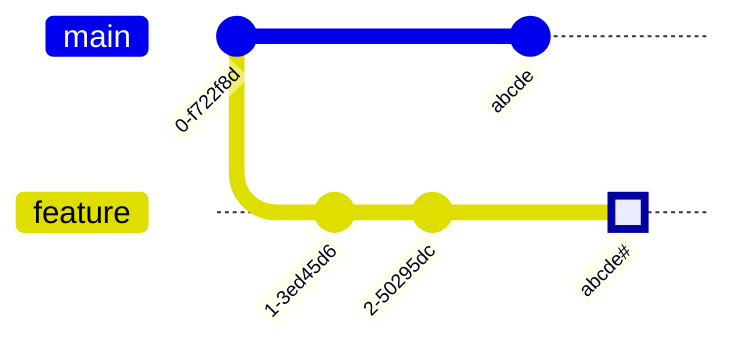
```mermaid
gitGraph
  commit
  branch feature
  checkout feature
  commit
  commit
  checkout main
  commit id: "abcde"
  checkout feature
  commit type: HIGHLIGHT id: "abcde#"
```
</v-click>

---
layout: two-cols-header
---

<slideTitle colour="pink-900">

## `git cherry-pick` 
</slideTitle>

::left::
<div class="ml-2">

### <carbon-thumbs-up class="text-green-500"/> Use Cases

- Porting a critical fix from `dev` to `production` immediately
  
- Moving a feature from a new version to an older branch
  
- Recovering a single commit from a deleted or messy branch
</div>
::right::
<div class="ml-2">
<v-click>

### <carbon-warning-alt class="text-red-500"/> Trade-offs
- The same change exists multiple times in history under different IDs
  
- You commit needs to contain everything that you need and be independent
  
- Frequent use often means your **Feature Branching** strategy is breaking down

</v-click>
</div>
---
layout: two-cols-header
---

<slideTitle colour="pink-900">

## `git rebase` 
</slideTitle>

::left::
<div class="mx-2">

### The Concept

<v-clicks>

Takes a **sequence of commits** and re-applies them **one by one** onto a new base commit.  
</v-clicks>

<div v-click class="mt-4 mr-4 p-4 bg-orange-500/10 border-l-4 border-orange-500 rounded-r text-orange-200">
  <strong>The "Automated" Cherry-Pick:</strong><br>
  It's like running a series of cherry-picks for every commit in your branch, one by one.
</div>
</div>
::right::
<div class="mx-2">
<v-click>

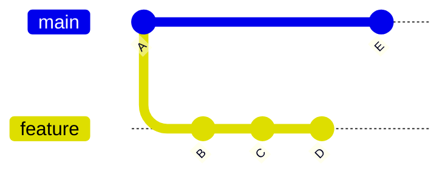
```mermaid

gitGraph
  commit id: "A"
  branch feature
  checkout feature
  commit id: "B"
  commit id: "C"
  commit id: "D"
  switch main
  commit id: "E"

```
</v-click>
<div v-click class="mt-6">

`git switch feature`

`git rebase main`

</div>

</div>
---
layout: two-cols-header
---
<slideTitle colour="pink-900">

## `git rebase` onto main
</slideTitle>

::left::
<div class="mx-2">
<v-click>

### What Git does internally

</v-click>

<v-clicks>

1. Temporarily removes commits B, C, D
2. Moves the feature branch pointer to point at E
3. Cherry-picks B, then C, then D

</v-clicks>
</div>
::right::
<div class="mx-2">


```mermaid

gitGraph
  commit id: "A"
  branch feature
  checkout feature
  commit id: "B"
  commit id: "C"
  commit id: "D"
  switch main
  commit id: "E"

```

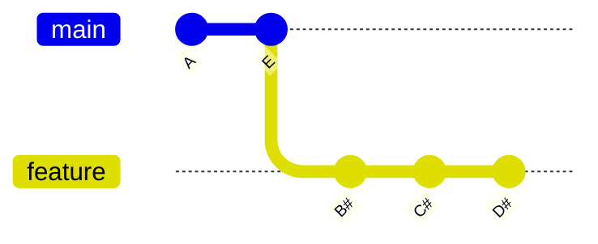
```mermaid
gitGraph
  commit id: "A"
  commit id: "E"
  branch feature
  checkout feature
  commit id: "B#"
  commit id: "C#"
  commit id: "D#"
```
<v-clicks>

- `B#`, `C#`, `D#` are **new commits**
- They contain the same changes, but have different hashes as the commits have different parents

</v-clicks>
</div>


---

<slideTitle colour="pink-900">

## Rebasing vs merging
</slideTitle>

<div class="grid grid-cols-2">
<div>

### `git merge`

<v-click>

```mermaid
gitGraph
  commit id: "init-commit"
  branch feature
  checkout feature
  commit id: "my-feat"
  checkout main
  commit id: "bug-fix"
```

</v-click>
<v-click>

```mermaid
gitGraph
  commit id: "init-commit"
  branch feature
  checkout feature
  commit id: "my-feat"
  checkout main
  commit id: "bug-fix"
  checkout main 
  merge feature id: "merge-feat"
```

</v-click>
</div>

<div >

### `git rebase`
<v-click>

```mermaid
gitGraph
  commit id: "init-commit"
  branch feature
  checkout feature
  commit id: "my-feat"
  checkout main
  commit id: "bug-fix"
```

</v-click>

<div v-click="4" v-if="$clicks===4"> 
```mermaid
gitGraph
  commit id: "init-commit"
  commit id: "bug-fix"
  branch feature
  checkout feature
  commit id: "my-feat'"
  checkout main
```
</div>

<div v-click="5"> 

```mermaid
gitGraph
  commit id: "init-commit"
  commit id: "bug-fix"
  commit id: "my-feat'"

```

</div>
</div>
</div>

<!--
You lose the knowledge that this was where a branch was merged in
-->

---
layout: default
---

<slideTitle colour="pink-900">

## Rebasing vs Merging
</slideTitle>

<div class="grid grid-cols-2 gap-8 mt-4 mx-2">
<v-clicks>

<div class="space-y-4">

### `git rebase`
- **Linear, readable history**
  
- Easier `git log` and `git bisect`
  
- Avoids noisy merge commits
</div>

<div class="space-y-4">

### `git merge`
- More comprehensive history
  
- No rewriting of history
  
- Easier to understand and use
</div>
</v-clicks>
</div>

<div v-show="$clicks > 2" class="bg-red-500/10 border-2 border-red-500/50 p-4 rounded-xl mt-4 mx-2">
<v-click>
<h3 class="text-red-400 mt-0 mb-3 flex items-center gap-2">
<carbon-warning class="text-red-500"/> 
Be very careful when rebasing in a team
</h3>
</v-click>

<div class="grid grid-cols-2 gap-8 text-md">
<v-click>
<div>
<span class="text-green-400 font-bold">Safe when:</span>
<ul class="mt-2 opacity-90">
<li>You are working alone</li>
<li>The branch is private</li>
<li>The commits have not been shared</li>
</ul>
</div>
</v-click>

<v-click>
<div>
<span class="text-red-400 font-bold">Dangerous when:</span>
<ul class="mt-2 opacity-90">
<li>The branch is shared</li>
<li>Others have based work on it</li>
</ul>
</div>
</v-click>
</div>
</div>

---
layout: two-cols-header
src: pages/reset.md
---

---
layout: default
---


<slideTitle colour="pink-900">

## `git reflog`
</slideTitle>

<span class="mt-2 mx-2">The annoying truth-telling version of `git log` 
</span>

<div class="grid grid-cols-2 gap-2 mx-2">
<div class="">

`git log`


<div v-if="$clicks <= 2" v-click>

- Shows the current HEAD and where it has been
- It prints the commit HEAD points to, then its parent, its parent, and so on.

</div>
<div v-click="3">

```bash
commit e6edcdc (HEAD -> main, new-branch)
Author: Lizzie Salmon <lizzie.salmon@stfc.ac.uk>
Date:   Tue Feb 3 15:47:03 2026 +0000

    feat: Add to do

commit f6e25d1
Author: Lizzie Salmon <lizzie.salmon@stfc.ac.uk>
Date:   Mon Feb 2 17:12:44 2026 +0000

    feat: new file (dont delete this)

commit 9479df0
Author: Lizzie Salmon <lizzie.salmon@stfc.ac.uk>
Date:   Mon Feb 2 17:11:40 2026 +0000

    feat: Initial To Do list

```
</div>

</div>

<div>

`git reflog`


<div v-if="$clicks <= 2" v-click="2" >

- Shows an ordered list of the commits that HEAD has pointed to
- It's a fully comprehensive history for your *local* repo
- It means that nothing is permanently lost EVER

</div>
<div v-click="4">

```bash
e6edcdc (HEAD -> main, new-branch) HEAD@{0}: merge new-branch: Fast-forward
f6e25d1 HEAD@{1}: checkout: moving from new-branch to main
e6edcdc (HEAD -> main, new-branch) HEAD@{2}: commit (amend): feat: Add to do
191f995 HEAD@{3}: commit: Add to do
f6e25d1 HEAD@{4}: checkout: moving from main to new-branch
f6e25d1 HEAD@{5}: reset: moving to f6e25d1
9479df0 HEAD@{6}: reset: moving to HEAD~1
f6e25d1 HEAD@{7}: commit: feat: new file (dont delete this)
9479df0 HEAD@{8}: commit (initial): feat: Initial To Do list

```
</div>

<div v-click="6" class="p-3 bg-blue-500/10 rounded border-l-4 border-blue-500 m-2">
<div class=" leading-tight">
  You can also use time-based notation: 

- `main@{yesterday}`
- `HEAD@{5.minutes.ago}`
</div>
</div>

</div>
</div>

<!-- When `git log` can't tell you what happened, `git reflog` can.

You finished a feature, merged it, and <b>deleted the branch</b>. 
  Suddenly, you realize you missed a file. 
  You rebased your branch onto `main`, but you messed up the conflict resolution and the code is now broken.
   -->

---

<slideTitle colour="pink-900">

## `git rebase -i`
</slideTitle>
<div class="mx-2">

`git rebase -i` is a powerful tool that lets you **rewrite, reorder, and clean up** your commit history before sharing it with others.
</div>
<div class="mx-2">

Your current `git log --oneline` looks a bit like a crime scene:

<div class="w-90">

```bash
e9ae60a (HEAD -> main) finally finished
084d7a2 oops typo
1c73d8a temp for lunch
d5f50ae figured it out!!
031def5 refactor
296fdf7 step 2
e301f45 do step 3
11499a4 why is step 1 not working
35218b6 Add debugging commands
8d29336 feat: implement step 1
```
</div>
</div>
---

<slideTitle colour="pink-900">

## `git rebase -i`
</slideTitle>
<div class="mx-2">

To start an interactive rebase we can run `git rebase -i` followed by what you want to rebase
- This could be another branch `feature-x`
- Or the current branch (use `HEAD~6` for the last 6 commits)
- For the whole current branch use `--root`

<v-click>

<div class="w-90">

```bash
pick 8d29336 feat: implement step 1
pick 35218b6 Add debugging commands
pick 11499a4 why is step 1 not working
pick e301f45 do step 3
pick 296fdf7 step 2
pick 031def5 refactor
pick d5f50ae figured it out!!
pick 4b877d0 temp for lunch
pick b8f0c70 oops typo
pick 0c76067 finally finished
```
</div>
</v-click>
</div>
---

<slideTitle colour="pink-900">

## `git rebase -i`
</slideTitle>
<div class="mx-2">

| Command | Short | Action | Result |
| :--- | :--- | :--- | :--- |
| **Pick** | `p` | Use the commit as-is | Keeps it in history |
| **Squash** | `s` | Use commit, but meld into previous | Combines logs; prompts for new message |
| **Fixup** | `f` | Like squash, but discard log message | Cleanest way to merge "typo fix" commits |
| **Reword** | `r` | Use commit, but edit message | Fix those "WIP" or "temp" titles |
| **Drop** | `d` | Remove the commit entirely | Deletes the changes from history |
| **Edit** | `e` | Stop the rebase for amends | Lets you change files or split one commit into many |

</div>
---
layout: default
---

<slideTitle colour="pink-900">

## `git rebase -i`
</slideTitle>

<div class="grid grid-cols-2 mx-2">
<div class="mr-2">

```bash {1|-2|-3|-5|}
pick 8d29336 feat: implement step 1 # Keep this one
fixup 11499a4 why is step 1 not working # Squash above
drop 35218b6 Add debugging commands #drop this commit
reword 296fdf7 step 2 # swap commits round and reword
r e301f45 do step 3 
f 031def5 refactor # fixup all the rest into one commit
f d5f50ae figured it out!!
f 4b877d0 temp for lunch
f b8f0c70 oops typo
f 0c76067 finally finished
```
</div>

<div class="mt-3">
<v-click>

- Walked through (like in a normal rebase)
  - Any conflicts
  - Any squashed commits 
  - Any reworded commits 
- Keep running `git rebase --continue`

</v-click>
</div>
</div>

<div v-click class="mt-8 p-4 mx-2 bg-orange-500/10 border-l-4 border-orange-500 rounded">
<span class="flex items-center gap-2 m-0! font-bold text-orange-400">
<mdi-lightbulb-on-outline class="text-yellow"/> DON'T FORGET
</span>
<span class="mt-1 opacity-90">

If things get messy or confusing, you can **ALWAYS**
run:

`git rebase --abort`

This returns you safely to the exact state you were in before you started.

</span>
</div>

---
layout: default
---

<slideTitle colour="pink-900">

## `git rebase -i`
</slideTitle>
<div class="mx-2">

### Our new `git log` looks like: 

```bash
5318de1 (HEAD -> main) feat: implement step 3
a5f6ffb feat: implement step 2
1e328f4 feat: implement step 1
```

<div v-click class="mt-4">

### Just think of the possibilities...
</div>

<v-clicks>

- Make it look like you wrote the tests first
  
- Move the refactor to be *before* the feature
  
- No more "I forgot to lint" commits

- Use edit to make monster commits into smaller ones

- Confidence to experiment freely, knowing you can "squash" the mess later.

</v-clicks>
</div>

<!--
You can also do something even more granular with small changes instead of whole commits you can use `git add --patch`

Makes life easier for the reviewer, not just about making yourself look sane
-->

---
layout: default
---

<slideTitle colour="pink-900">

## `git push` with force
</slideTitle>

<div class="grid grid-rows-2 mx-2">
<div>
<v-clicks>

Because we **rewrote** history, our local branch and the remote branch may no longer agree (if we pushed before rebasing etc). 

We have to "force" our version to be the truth.

Tutorials often suggest `git push --force` (or `-f`). 

The better option is `--force-with-lease`
</v-clicks>

</div>
<div v-click>

| Command | Safety Level | Behavior |
| :--- | :--- | :--- |
| `--force` |  **Dangerous** | Overwrites the remote branch no matter what |
|`--force-with-lease` | **Recommended** | It only works if **no one else** has pushed new commits to the remote branch since you last fetched. |

</div>
</div>


---
layout: center
hideInToc: true
---

<slideTitle colour="indigo-900">

## Congratulations! You are now a Git Time Traveller
</slideTitle>
<p class="mt-2 mb-8 mx-2 italic">
  (I told you so.)
</p>

<div class="grid grid-cols-2 gap-6 text-left mx-2">
  <div v-click class="p-4 border border-main rounded-lg bg-main/5">
    <div class="flex items-center gap-3 mb-2">
      <mdi-check-bold class="text-blue-400 text-2xl" />
      <h3 class="p-0 m-0">The "Why"</h3>
    </div>
    <p class="text-sm opacity-80">
      You're no longer just memorising commands, you're consciously making changes to the git graph.
    </p>
  </div>

  <div v-click class="p-4 border border-main rounded-lg bg-main/5">
    <div class="flex items-center gap-3 mb-2">
      <mdi-check-bold class="text-yellow-400 text-2xl" />
      <h3 class="p-0 m-0">Conflict Mastery</h3>
    </div>
    <p class="text-sm opacity-80">
      You now have the tools to prevent and resolve conflicts.
    </p>
  </div>

  <div v-click class="p-4 border border-main rounded-lg bg-main/5">
    <div class="flex items-center gap-3 mb-2">
      <mdi-check-bold class="text-green-400 text-2xl" />
      <h3 class="p-0 m-0">The Toolbox</h3>
    </div>
    <p class="text-sm opacity-80">
      From <code>rebase -i </code> to <code>--abort</code>, your toolkit is ready for any workflow disaster.
    </p>
  </div>

  <div v-click class="p-4 border border-main rounded-lg bg-main/5">
    <div class="flex items-center gap-3 mb-2">
      <mdi-check-bold class="text-purple-400 text-2xl" />
      <h3 class="p-0 m-0">History Rewriting</h3>
    </div>
    <p class="text-sm opacity-80">
      Your PRs will now tell a professional story that your future self and teammates will love.
    </p>
  </div>
</div>

<div v-click class="mt-10 text-center">
  <p class="text-xl font-bold">Go and <code>--force-with-lease</code> responsibly!</p>
</div>


<div class="bg-purple-900"></div>
<div class="bg-blue-900"></div>
<div class="bg-green-900"></div>
<div class="bg-orange-900"></div>
<div class="bg-teal-800"></div>
<div class="bg-pink-900"></div>
<div class="bg-indigo-900"></div>
<div class="bg-sky-800"></div>
