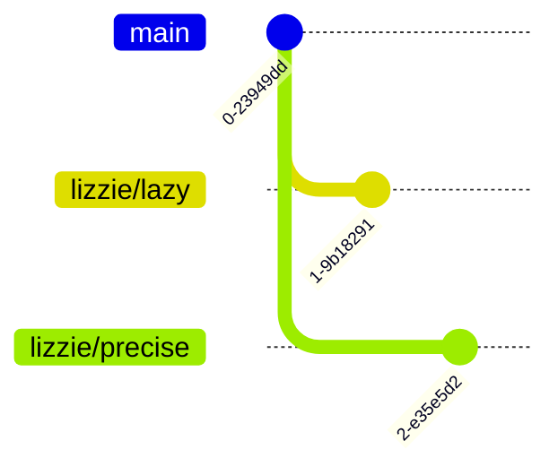

<div class="bg-purple-900 w-100% py-2 px-2">

# Git in Practice  
## Techniques for Collaborative Development

</div>

---

<div class="bg-purple-900 pa-2">

## Talk contents
</div>

<Toc class="ml-2 my-2" maxDepth="1"/>

---
layout: section
---
<sectionTitle colour="green-900">

# Why Git Hurts in Teams
</sectionTitle>
---
layout: two-cols-header
---
<slideTitle colour="green-900">

## The Solo Experience
</slideTitle>


::left:: 


<v-clicks class="ml-4">

 - Linear history
 - Zero conflicts
 - Total control 
</v-clicks>

::right:: 

<div v-click class="p-4 rounded-lg shadow-xl">
<p class="text-xs mb-2 font-mono">This is what we expect</p>
<div class="scale-90 origin-top">


</div>
</div>

---
layout: default
---
<slideTitle colour="green-900">

## The Team Reality
</slideTitle>

<div class="grid grid-cols-3 gap-4 ml-4">
<v-clicks class="col-span-1">

- You are 4 commits ahead
- John force-pushed his hotfix
- Richard's refactor has been approved
- Nobody has pulled in 3 days

</v-clicks>

<div v-click class="col-span-2 transition-all duration-500">

</div>
</div>

<div v-click class="absolute inset-0 flex items-center justify-center bg-red-900/80 backdrop-blur-sm rounded-lg border-4 border-red-500 animate-shake">
<div class="text-center">
  <mdi-alert class="text-6xl mb-2" />

  ## CONFLICT
  <p class="font-mono">CONFLICT: Merge conflict in EVERYTHING.ts</p>
</div>
</div>

---
layout: two-cols-header
---

<slideTitle colour="green-900">

## Common Pain Points When Working in a Team
</slideTitle>

::left:: 

<br>
<v-clicks class="ml-4">

- A messy, unreadable commit history
- Long-lived branches that never merge cleanly
- Merge conflicts nobody understands
- Fear of breaking `main`
</v-clicks>

::right::

<div class="flex flex-shrink">
  <div v-click v-show="$clicks <= 5" >
    <BadGitHistory />
  </div>
  <div v-click v-show="$clicks > 5" >
    <Merge />
  </div>
</div>

---
layout: default
---
<slideTitle colour="green-900">

## Sounds Familiar?
</slideTitle>


<SoundsFamiliar class="mx-4"/>

---
layout: section
---

<sectionTitle colour="orange-900">

# How Git Actually Works
</sectionTitle>

---
layout: two-cols-header
src: ./pages/commit.md
hideInToc: true
---


---

<slideTitle colour="orange-900">

## Branches Are Just Pointers
</slideTitle>

<div class="grid grid-cols-2 gap-6 mx-2 h-90%">


<div>
<v-clicks>

- A branch is just an extra piece of metadata that gets passed along from parent to child 
- No copies, no magic 
- Multiple branches can point to the same commit

</v-clicks>
<br>
<div v-click="5">

- `git checkout feature-x`
- `git commit `
</div>
</div>
<div class="flex flex-col justify-around">
<div v-click="4">


</div>
<div v-click="6">


</div>
</div>
</div>

<!-- branches arent folders -->

--- 
layout: section
---

<sectionTitle colour="blue-900">

# Git Collaboration Workflows
</sectionTitle>

---
layout: two-cols-header
---
<slideTitle colour="blue-900">

## How Teams Use Git
</slideTitle>

::left::
<v-clicks class="mx-4">

- Each developer works in a **local Git repository** on their own machine
- Changes are committed **locally** first
- A **shared remote repository** (GitHub / GitLab) is used to:
  - Share work
  - Integrate changes
  - Review code
- The  `main` branch on the remote is often treated as the **source of truth**

</v-clicks>

::right::
<v-click>


</v-click>
---
layout: default
---
<slideTitle colour="blue-900">

## Git Workflows
</slideTitle>

<div class="grid grid-cols-2 gap-4 ma-2">
<v-clicks>
<div class=" p-4 rounded-lg border-2 border-blue-400/10">

* **Centralised:** 
  * Everyone pushes to `main`
  * Fast, but works best in small teams

</div>
<div class=" p-4 rounded-lg border-2 border-green-400/10">

* **Trunk-Based:** 
  * Short-lived branches with few commits 
  * High speed, requires good testing and CI

</div>
<div class=" p-4 rounded-lg border-2 border-purple-400/10">

* **Git Flow:** 
  * Rigid, multi-branch system
  * Great for scheduled releases, but *heavy*
  * Not recommended anymore
  
</div>
<div class=" p-4 rounded-lg border-2 border-orange-400/10">

* **Forking:** 
  * Everyone owns a server-side repository
  * Common in Open Source - don't give everyone "write" access.

</div>

</v-clicks>
</div>
<v-click>
<div class="ma-2 p-4 rounded-lg border-2 border-yellow-400/10 mt-4 flex justify-center">

**Feature Branching** balances safety (code reviews) with speed (parallel work)

</div>
</v-click>

---
layout: two-cols-header
---

<slideTitle colour="blue-900">

## Feature Branching
</slideTitle>

<div class="mb-1">
<p class="opacity-50 mt-2">Even when you're working solo or without a remote</p>

</div>

::left::

<v-clicks class="mx-2">

- To separate your work from the `main` branch 
- It's harder for unstable code to get merged into the main code base
- Gives you a chance to clean up your future git history before merging it into the main branch

- Make a new branch when you:
  - Make a new feature 
  - Fix a bug
  - Just experiment

</v-clicks>

::right:: 

<v-click>


</v-click>

<div v-click class="p-2 ma-4 border border-red-500/30 bg-red-500/10 rounded text-md font-bold flex items-center justify-center flex-shrink">
  <carbon-close-filled class="ma-1 text-red-500"/>

Never commit to `main`
</div>

<!-- Okay maybe it is fine to commit to main if  
- Solo projects with discipline
- Tiny obvious changes (README, config)
- True emergency hotfixes
- -->

---
layout: two-cols-header
---

<slideTitle colour="blue-900">

## A Typical Feature Branch Workflow with a Remote
</slideTitle>

::left::

<div class="ml-4">

```bash {1-3|5-7|9-10|12-13|15-16|18-21|all}
git checkout main
git pull origin main # update main
git checkout -b feature # create your branch

# Work locally
git add files
git commit -m "feat: add new todo item"

git fetch origin # update your local version of main
git merge origin/main # (or rebase, depending on team)

# Push your branch to the remote
git push origin feature

# Open a merge request / pull request
# Review → approve → merge

# Update your local main after merge
git checkout main
git pull origin main
# Your changes are visible!

```
</div>

::right:: 
<div class="ml-2">
<v-click> 


</v-click>

<v-click>

**Why this works:**

</v-click>

<v-clicks>

- Isolation: Bad code merged? main stays functional
- Collaboration: Push triggers a Pull Request — discussion
- Clean History: Merging back to main only happens once the code is "Done-Done"
</v-clicks>
</div>

---
layout: section
---

<sectionTitle colour="teal-800">

# Conflicts Happen 
</sectionTitle>

## Don't panic

---
layout: default
---

<slideTitle colour="teal-800">

## Creation of a conflict
</slideTitle>
<Conflicts />

---
layout: default
---

<slideTitle colour="teal-800">

## Anatomy of a Merge Conflict
</slideTitle>

<div class="grid grid-cols-2 gap-8 mx-2">
<div>
<div v-click>

```typescript
 <<<<<< HEAD
 console.log("Hello from Main");
 ======
 console.log("Hello from Feature");
 >>>>>> feature-branch
```

</div>
<div v-click="4">
<Arrow x1="250" y1="210" x2="250" y2="270"/>

<div class="mt-15">

```typescript
console.log("Hello from Feature")
```
</div>
</div>

</div> 
<div>
<v-click>

- `<<<<<<< HEAD`: Your current version (the "Base").
- `=======`: The divider between the two versions.
- `>>>>>>> branch`: The incoming version you are trying to merge.

</v-click>

<div v-click="3">
Delete the markers and pick the code you want to keep (or keep both!).

This is the manual way to resolve conflicts
</div>
</div>
</div>

---
layout: default
---

<slideTitle colour="teal-800">

## Our Example
</slideTitle>

<div class="grid grid-cols-2 mx-2">
<div>

We have three branches:

<v-clicks>

- `main` → current production logic (π ≈ 3.14)
- `lizzie/lazy` → quick fix (π ≈ 3)
- `lizzie/precise` → using (`math.pi`)

</v-clicks>
</div>
<div>

<v-click>


</v-click>
</div>
</div>

<div class="grid grid-cols-3 gap-2 mb-8 mx-2">

<div v-click>

On branch `main`

```python
def caluculate_circumference(radius):
    return(2*3.14*radius)
```
</div>


<div v-click>

On branch `lizzie/lazy`
```python
def caluculate_circumference(radius):
    return(2*3*radius)
```

</div>
<div v-click>

On branch `lizzie/precise`
```python
def caluculate_circumference(radius):
    return(2*math.pi*radius)
```
</div>
</div>
---

<slideTitle colour="teal-800">

## Resolving Conflicts
</slideTitle>
<div class="grid grid-cols-3 mx-2">
<div class="col-span-2">
<v-click>

```bash {1-2|1-}
# On branch main
lizzie:~/mergeConflicts$ git merge lizzie/lazy
Updating 68f5977..a76a9d8
Fast-forward
 circumference.py | 2 +-
 1 file changed, 1 insertion(+), 1 deletion(-) # This is a successful merge :) 

```
</v-click>
</div>
<v-click>


</v-click>

</div>

<div v-click=4>

```bash {all|1|1-}
lizzie:~/mergeConflicts$ git merge lizzie/precise
Auto-merging circumference.py
CONFLICT (content): Merge conflict in circumference.py
Automatic merge failed; fix conflicts and then commit the result. 
```
</div>

---
layout: default
---

<slideTitle colour="teal-800">

## Resolving Conflicts
</slideTitle>

<div class="grid grid-cols-2 gap-4 mx-2">
<div v-click>

open `circumference.py`

```python
def caluculate_circumference(radius):
 <<<<<< HEAD
    return(2*3*radius)
=======
    return(2*math.pi*radius)
>>>>>>> lizzie/precise
```
</div>

<div v-click>

And change it to be what we want
```python
def caluculate_circumference(radius):
    return(2*math.pi*radius)
```
</div>
</div>
---

```bash {1|-2|1-8|10|11|11-}
lizzie:~/mergeConflicts$ git add circumference.py
lizzie:~/mergeConflicts$ git status
On branch main
All conflicts fixed but you are still merging.
  (use "git commit" to conclude merge)

Changes to be committed:
        modified:   circumference.py

lizzie:~/mergeConflicts$ git commit
lizzie:~/mergeConflicts$ git log --oneline
821d728 (HEAD -> main) Merge branch 'lizzie/precise'
a76a9d8 (lizzie/lazy) fix: pi is three
6c87760 (lizzie/precise) fix: make more precise
68f5977 feat: Initial commit
```

---

<slideTitle colour="teal-800">

## Surely there is a better way than that?
</slideTitle>

- git has its own selection of merge tools

`git mergetool --tool=vimdiff`


---


---

<slideTitle colour="teal-800">

## Surely there is a better way than that?
</slideTitle>

- git has its own selection of merge tools

`git mergetool --tool=meld`


---

<slideTitle colour="teal-800">

## Surely there is a better way than that?
</slideTitle>

- VSCode has its inline merge resolving


- It also has its own Merge Editor 

---
layout: default
---


---


<slideTitle colour="teal-800">

## The Best Way to Prevent Conflicts
</slideTitle>
<p class="opacity-50 -mt-2 mb-8 mx-2">Stop them from happening in the first place</p>

<div class="grid grid-cols-3 gap-4 mx-2">

<div v-click class="p-4 rounded-xl border border-blue-500/20 bg-blue-500/5">
  
<h3 class="font-bold mb-1 flex items-center"> <carbon-paint-brush class="text-blue-400 text-3xl mb-1 mr-2" />Consistency</h3>

- Have a standard:
  - quotation marks
  - indentation
  - white space
  - import order
  - variable names
  - ...

</div>

<div v-click class="p-4 rounded-xl border border-green-500/20 bg-green-500/5">
  
<h3 class="font-bold mb-1 flex items-center"> <carbon-bot class="text-green-400 text-3xl mb-1 mr-2" />Automation</h3>

- Enforce some standards using linters

```js
//from eslint.config
stylistic: {
  indent: 2,
  quotes: 'single',
},
```

- The diff will only show logic changes
- Enforce those linters with git-hooks or CI/CD pipelines

</div>

<div v-click class="p-4 rounded-xl border border-purple-500/20 bg-purple-500/5">

<h3 class="font-bold mb-1 flex items-center">
<carbon-chat class="text-purple-400 text-3xl mb-1 mr-2" />
 Teamwork</h3>

- **Communicate**
- Small, atomic PRs
- Culture changes:
  - `git pull` and `git rebase` frequently
  - `git fetch` is a friend 

</div>
</div>


---
layout: section
---
<sectionTitle colour="pink-900">

# Git Power Tools
</sectionTitle>


## and how to use them without breaking things


---
layout: two-cols-header
src: pages/reset.md
---

---
layout: default
---


<slideTitle colour="pink-900">

## `git reflog`
</slideTitle>

<span class="opacity-50 mt-2 mx-2">The annoying truth-telling version of `git log` 
</span>

<div class="grid grid-cols-2 gap-2 mx-2">
<div class="">
<div class="text-red">

`git log`
</div>

<div v-if="$clicks <= 2" v-click>

- Shows the current HEAD and where it has been
- It prints the commit HEAD points to, then its parent, its parent, and so on.

</div>
<div v-click="3">

```bash
commit e6edcdc (HEAD -> main, new-branch)
Author: Lizzie Salmon <lizzie.salmon@stfc.ac.uk>
Date:   Tue Feb 3 15:47:03 2026 +0000

    feat: Add to do

commit f6e25d1
Author: Lizzie Salmon <lizzie.salmon@stfc.ac.uk>
Date:   Mon Feb 2 17:12:44 2026 +0000

    feat: new file (dont delete this)

commit 9479df0
Author: Lizzie Salmon <lizzie.salmon@stfc.ac.uk>
Date:   Mon Feb 2 17:11:40 2026 +0000

    feat: Initial To Do list

```
</div>

</div>

<div>

<div class="text-red">

`git reflog`
</div>

<div v-if="$clicks <= 2" v-click="2" >

- Shows an ordered list of the commits that HEAD has pointed to
- It's a fully comprehensive history for your *local* repo
- It means that nothing is permanently lost EVER

</div>
<div v-click="4">

```bash
e6edcdc (HEAD -> main, new-branch) HEAD@{0}: merge new-branch: Fast-forward
f6e25d1 HEAD@{1}: checkout: moving from new-branch to main
e6edcdc (HEAD -> main, new-branch) HEAD@{2}: commit (amend): feat: Add to do
191f995 HEAD@{3}: commit: Add to do
f6e25d1 HEAD@{4}: checkout: moving from main to new-branch
f6e25d1 HEAD@{5}: reset: moving to f6e25d1
9479df0 HEAD@{6}: reset: moving to HEAD~1
f6e25d1 HEAD@{7}: commit: feat: new file (dont delete this)
9479df0 HEAD@{8}: commit (initial): feat: Initial To Do list

```
</div>
</div>
</div>


---
layout: two-cols-header
---
<slideTitle colour="pink-900">

## `git reflog` saving the day
</slideTitle>

::left::

<div class="mx-2">

```bash {all|1-2|4-6|7-9|10-12|13-17|18-20|21-24}
$ git commit -m "feat: Initial To Do list"
[main 9479df0] feat: Initial To Do list

$ git commit -m "feat: new file (dont delete this)"
[main f6e25d1] feat: new file (dont delete this)

$ git reset --hard HEAD~1 # <--- disaster has struck!! 
HEAD is now at 9479df0 feat: Initial To Do list

$ git log --oneline
9479df0 (HEAD -> main) feat: Initial To Do list

$ git reflog
9479df0 HEAD@{0}: reset: moving to HEAD~1
f6e25d1 HEAD@{1}: commit: feat: new file (dont delete this)
9479df0 HEAD@{2}: commit (initial): feat: Initial To Do list

$ git reset --hard HEAD@{1}
HEAD is now at f6e25d1 feat: new file (dont delete this)

$ git log --oneline
f6e25d1 (HEAD -> main) feat: new file (dont delete this)
9479df0 feat: Initial To Do list
```
</div>

::right::

<div class="ma-2">

<div v-click="5">

- `9479df0`  is the 7-character short SHA of the commit.


- `HEAD@{2}:` explains that this is the second prior position of the head

  - `@{0}` is the current position of the head
  - `@{1}` is the previous step
- `commit` / `checkout` / `reset`
  - This is the action that caused the move

</div>
</div>


<div v-click="6" class="p-3 bg-blue-500/10 rounded border-l-4 border-blue-500 m-2">
<div class=" leading-tight">
  <b>Tip:</b> 
  You can also use time-based notation: 

- `main@{yesterday}`
- `HEAD@{5.minutes.ago}`
</div>
</div>
---
layout: default
---
<slideTitle colour="pink-900">

## Beyond undoing `reset`
</slideTitle>

<div class="opacity-50 -mt-2 mb-8 mx-2">

When `git log` can't tell you what happened, `git reflog` can.
</div>

<div class="grid grid-cols-3 gap-4 mx-2">

  <div v-click class="p-4 rounded-xl border border-orange-500/20 bg-orange-500/5">
  <h3 class="font-bold mb-1 flex items-center"> <carbon-branch class="text-orange-400 text-2xl" /> Deleted Branch</h3>
  <div class="text-sm opacity-80">
  
  You finished a feature, merged it, and <b>deleted the branch</b>. 
  Suddenly, you realize you missed a file. 
  </div>
  </div>

  <div v-click class="p-4 rounded-xl border border-blue-500/20 bg-blue-500/5">
  <h3 class="font-bold mb-1 flex items-center"> <carbon-direction-merge class="text-blue-400 text-2xl" /> Messy Conflicts</h3>
  <div class="text-sm opacity-80">
    
  You rebased your branch onto `main`, but you messed up the conflict resolution and the code is now broken.
  </div>
  </div>

  <div v-click class="p-4 rounded-xl border border-purple-500/20 bg-purple-500/5">

  <h3 class="font-bold mb-1 flex items-center"><mdi-ghost-outline class="text-purple-400 text-2xl" />Lost Amend</h3>
  
  <div class="text-sm opacity-80">
  
  You used `git commit --amend` to fix a typo, but accidentally overwrote a bunch of good code in the process.
  </div>
  </div>

</div>

<div v-click class="p-4 text-center rounded-xl border border-purple-500/20 bg-pink-500/5 mt-4 mx-2">
  If you committed it, it's in the reflog.
</div>
---
layout: two-cols-header
---
<slideTitle colour="pink-900">

## `git cherry-pick` 
</slideTitle>

<div class="opacity-50 -mt-2 mb-8 mx-2 ">

copying a commit
</div>

::left:: 

<v-clicks class="mx-2">

- Selects a **single commit**
- Applies its changes elsewhere
- Does **not** move the original commit
</v-clicks>

<div v-click="5" class="mx-2">

`git checkout main`

`git cherrypick abcde`
</div>

::right:: 

<v-click>


</v-click>

---
layout: two-cols-header
---

<slideTitle colour="pink-900">

## `git cherry-pick` 
</slideTitle>

<div class="opacity-50 mt-2 mb-8">
"I just want that one specific commit"
</div>

::left::
<div class="ml-2">

### <carbon-thumbs-up class="text-green-500"/> Use Cases

- **Hotfixes:** Porting a critical fix from `dev` to `production` immediately
  
- **Backports:** Moving a feature from a new version to an older branch
  
- **Lost Work:** Recovering a single commit from a deleted or messy branch
</div>
::right::
<div class="ml-2">
<v-click>

### <carbon-warning-alt class="text-red-500"/> The Hidden Costs
- **Duplicate changes**: The same change exists multiple times in history under different IDs
  
- **Merge Conflicts:** Can cause "ghost" conflicts later
  
- **Workflow Issues:** Frequent use often means your **Feature Branching** strategy is breaking down

</v-click>
</div>
---
layout: two-cols-header
---

<slideTitle colour="pink-900">

## `git rebase` 
</slideTitle>
<div class="opacity-50 mt-2 mb-10">
Replaying commits to create a linear history
</div>

::left::
<div class="mx-2">

### The Concept

<v-clicks>

- Takes a **sequence of commits**
- Re-applies them **one by one**
- Onto a new base commit
</v-clicks>

<div v-click class="mt-4 mr-4 p-4 bg-orange-500/10 border-l-4 border-orange-500 rounded-r text-orange-200">
  <strong>The "Automated" Cherry-Pick:</strong><br>
  It's like running a series of cherry-picks for every commit in your branch, one by one.
</div>
</div>
::right::
<div class="mx-2">
<v-click>


</v-click>
<div v-click class="mt-6">
```bash
git checkout feature
git rebase main
```
</div>

</div>
---
layout: two-cols-header
---
<slideTitle colour="pink-900">

## `git rebase` onto main
</slideTitle>

::left::
<div class="mx-2">
<v-click>

### What Git does internally

</v-click>

<v-clicks>

1. Temporarily removes commits B, C, D
2. Moves the feature branch pointer to point at E
3. Cherry-picks B, then C, then D

</v-clicks>
</div>
::right::
<div class="mx-2">


<v-clicks>

- `B'`, `C'`, `D'` are **new commits**
- They contain the same changes, but have different hashes as the commits have different parents

</v-clicks>
</div>

---
layout: default
---

<slideTitle colour="pink-900">

## Why `git rebase` 
</slideTitle>

<div class="grid grid-cols-2 gap-8 mt-4 mx-2">
<v-clicks>

<div class="space-y-4">

### <carbon-thumbs-up class="text-green-500"/> Benefits
- **Linear, readable history**
  
- Easier `git log` and `git bisect`
  
- Avoids noisy merge commits
</div>

<div class="space-y-4">

### <carbon-warning-alt class="text-red-500"/> Trade-offs
- Rewrites commit history
  
- Changes commit hashes
  
- Can confuse collaborators
</div>
</v-clicks>
</div>

<div v-show="$clicks > 2" class="bg-red-500/10 border-2 border-red-500/50 p-4 rounded-xl mt-4 mx-2">
<v-click>
<h3 class="text-red-400 mt-0 mb-3 flex items-center gap-2">
<carbon-warning class="text-red-500"/> 
Be very careful when rebasing in a team
</h3>
</v-click>

<div class="grid grid-cols-2 gap-8 text-md">
<v-click>
<div>
<span class="text-green-400 font-bold">Safe when:</span>
<ul class="mt-2 opacity-90">
<li>You are working alone</li>
<li>The branch is private</li>
<li>The commits have not been shared</li>
</ul>
</div>
</v-click>

<v-click>
<div>
<span class="text-red-400 font-bold">Dangerous when:</span>
<ul class="mt-2 opacity-90">
<li>The branch is shared</li>
<li>Others have based work on it</li>
</ul>
</div>
</v-click>
</div>
</div>
---
layout: section
---

<sectionTitle colour="indigo-900">

# Shaping History Intentionally
</sectionTitle>

<div class="grid grid-cols-2">

## Tell the story you want to tell

<div v-click class="bg-red-500/10 border-2 mr-2 border-red-500/50 p-4 rounded-xl">
<div class="text-red-400 mt-0 mb-3 gap-2">

You have a lot of freedom to rewrite your history locally.
<br>
But be careful if it is on a shared branch that other people may have based work off of
</div>
</div>
</div>
---
---

<slideTitle colour="indigo-900">

## `git commit --amend`
</slideTitle>

<div class="mx-2">

The simplest way to rewrite history.  It allows you to modify the **very last commit** you made. 
</div>
<div v-click class="mt-8 mx-2">

When you just made a commit and suddently realise:
</div>
<div class="mx-2">
<v-clicks>

- You made a typo in the commit message
  
- You forgot to stage one tiny file
  
- You left a `console.log` or in the code
  
- You forgot to run the linter

</v-clicks>
</div>
---

<slideTitle colour="indigo-900">

## `git commit --amend`
</slideTitle>
<div class="mx-2">

Instead of creating a **new** small "typo" commit, you update the previous one.
</div>

<div class="grid grid-cols-2 gap-4 mt-4 text-left mx-2">
<div v-click class="bg-gray-500/5 p-4 rounded border border-white/10">
<h3 class="text-purple-400 mb-2">Scenario A: Fix the Message</h3>
You just want to change the text.

`git commit --amend -m "New better message"`
</div>
<div v-click class="bg-gray-500/5 p-4 rounded border border-white/10">
<h3 class="text-pink-400 mb-2">Scenario B: Add Files</h3>
You forgot to add a file.

`git add forgotten-file.ts`

`git commit --amend --no-edit`

(`--no-edit` keeps the existing message)
</div>
</div>

--- 
layout: two-cols-header
---

<slideTitle colour="indigo-900">

## `git add --patch`
</slideTitle>

::left:: 

<v-clicks>
<div class="mx-2">

Stop committing "everything in this file." Start committing **logical changes.**
</div>

<div class="mx-2">

`git add -p` breaks your changes down into **hunks** (small chunks of code, like you see on github/gitlab). 

Git will ask you: *"Do you want to stage this specific change?"*

</div>
</v-clicks>

::right::

<v-click>

### Why use it?
</v-click>

<v-clicks>

- Separate "feature work" from "other" work (tests, cleanup, refactor) in the same file
  
-  Catch `console.log` or temporary hacks before they ever get staged - like a pre-review review
  
- It forces you to look at every single line you changed.

</v-clicks>
---

<slideTitle colour="indigo-900">

## `git add --patch`
</slideTitle>
<div class="mx-2">

When you run `git add --patch`, you'll see a diff and a prompt:
`Stage this hunk [y, n, q, a, d, s, e, ?]?`


| Key | Action | Result |
| :--- | :--- | :--- |
| **y** | Yes | Stage this hunk for the next commit|
| **n** | No | Skip this hunk (keep it in your working directory)|
| **s** | Split | Break this hunk into even smaller pieces|
| **q** | Quit | Stop right here and keep what you've already staged|
| **e** | Edit | Manually pick which lines to keep (The ultimate power) |
</div>

---
layout: full
class: "pa-0"
---


---


<slideTitle colour="indigo-900">

## Interactive Rebase
</slideTitle>

<div class="mx-2">

`git rebase -i` is a powerful tool that lets you **rewrite, reorder, and clean up** your commit history before sharing it with others.
</div>
<br>
<div class="mx-2">
<v-click>

### Why use it?
</v-click>

<v-clicks>

-  Combine "Work in progress" commits into one logical feature.

- Fix typos in commit messages or remove accidental file additions.

- Keep a clean, readable project timeline.

- Confidence to experiment freely, knowing you can "squash" the mess later.

</v-clicks>
</div>
---

<slideTitle colour="indigo-900">

## `git rebase -i`
</slideTitle>
<div class="mx-2">

Your current `git log --oneline` looks a bit like a crime scene:

```bash
e9ae60a (HEAD -> main) finally finished
084d7a2 oops typo
1c73d8a temp for lunch
d5f50ae figured it out!!
031def5 refactor
296fdf7 step 2
e301f45 do step 3
11499a4 why is step 1 not working
8d29336 feat: implement step 1
```
</div>
---

<slideTitle colour="indigo-900">

## `git rebase -i`
</slideTitle>
<div class="mx-2">

- To start an interactive rebase we can run `git rebase -i` followed by what you want to rebase
- This could be another branch `feature-x`
- Or the current branch (use `HEAD~6` for the last 6 commits)
- For the whole current branch use `--root`

<v-click>

```bash
pick 8d29336 feat: implement step 1
pick 11499a4 why is step 1 not working
pick e301f45 do step 3
pick 296fdf7 step 2
pick 031def5 refactor
pick d5f50ae figured it out!!
pick 4b877d0 temp for lunch
pick b8f0c70 oops typo
pick 0c76067 finally finished

####
```
</v-click>
</div>
---

<slideTitle colour="indigo-900">

## `git rebase -i`
</slideTitle>
<div class="mx-2">

| Command | Short | Action | Result |
| :--- | :--- | :--- | :--- |
| **Pick** | `p` | Use the commit as-is | Keeps it in history |
| **Squash** | `s` | Use commit, but meld into previous | Combines logs; prompts for new message |
| **Fixup** | `f` | Like squash, but discard log message | Cleanest way to merge "typo fix" commits |
| **Reword** | `r` | Use commit, but edit message | Fix those "WIP" or "temp" titles |
| **Drop** | `d` | Remove the commit entirely | Deletes the changes from history |
| **Edit** | `e` | Stop the rebase for amends | Lets you change files or split one commit into many |

</div>
---
layout: default
---

<slideTitle colour="indigo-900">

## `git rebase -i`
</slideTitle>

<div class="grid grid-cols-2 mx-2">
<div class="mr-2">

```bash {1|-2|-4||-9}
pick 8d29336 feat: implement step 1 # Keep this one
fixup 11499a4 why is step 1 not working # Squash above
reword 296fdf7 step 2 # swap commits round and reword
r e301f45 do step 3 
f 031def5 refactor # fixup all the rest into one commit
f d5f50ae figured it out!!
f 4b877d0 temp for lunch
f b8f0c70 oops typo
f 0c76067 finally finished
```
</div>

<div class="mt-3">
<v-click>

- Walked through (like in a normal rebase)
  - Any merge conflicts
  - Any squashed commits 
  - Any reworded commits 
- Keep running `git rebase --continue`

</v-click>
</div>
</div>

<div v-click class="mt-8 p-4 mx-2 bg-orange-500/10 border-l-4 border-orange-500 rounded">
<span class="flex items-center gap-2 m-0! font-bold text-orange-400">
<mdi-lightbulb-on-outline class="text-yellow"/> DON'T FORGET
</span>
<span class="mt-1 opacity-90">

If things get messy or confusing, you can **ALWAYS**
run:

`git rebase --abort`

This returns you safely to the exact state you were in before you started.

</span>
</div>


---
layout: default
---

<slideTitle colour="indigo-900">

## `git rebase -i`
</slideTitle>
<div class="mx-2">

### Our new `git log` looks like: 

```bash
5318de1 (HEAD -> main) feat: implement step 3
a5f6ffb feat: implement step 2
1e328f4 feat: implement step 1
```

<div v-click class="mt-4">

### Just think of the possibilities...
</div>

<v-clicks>

- Make it look like you wrote the tests first
  
- Move the refactor to be *before* the feature
  
- No more "I forgot to lint" commits

- Use edit to make monster commits into smaller ones

</v-clicks>
</div>

---
layout: default
---

<slideTitle colour="indigo-900">

## `git push` with force
</slideTitle>

<div class="grid grid-rows-2 mx-2">
<div>
<v-clicks>

Because we **rewrote** history, our local branch and the remote branch may no longer agree (if we pushed before rebasing etc). 

We have to "force" our version to be the truth.

Tutorials often suggest `git push --force` (or `-f`). 

The better option is `--force-with-lease`
</v-clicks>

</div>
<div v-click>

| Command | Safety Level | Behavior |
| :--- | :--- | :--- |
| `--force` |  **Dangerous** | Overwrites the remote branch no matter what |
|`--force-with-lease` | **Recommended** | It only works if **no one else** has pushed new commits to the remote branch since you last fetched. |

</div>
</div>


---
layout: center
hideInToc: true
---

<slideTitle colour="indigo-900">

## Congratulations! You are now a Git Time Traveller
</slideTitle>
<p class="opacity-80 mt-2 mb-8 mx-2 italic">
  (I told you so.)
</p>

<div class="grid grid-cols-2 gap-6 text-left mx-2">
  <div v-click class="p-4 border border-main rounded-lg bg-main/5">
    <div class="flex items-center gap-3 mb-2">
      <mdi-check-bold class="text-blue-400 text-2xl" />
      <h3 class="p-0 m-0">The "Why"</h3>
    </div>
    <p class="text-sm opacity-80">
      You're no longer just memorizing strings of text—you're manipulating a git graph with intent.
    </p>
  </div>

  <div v-click class="p-4 border border-main rounded-lg bg-main/5">
    <div class="flex items-center gap-3 mb-2">
      <mdi-check-bold class="text-yellow-400 text-2xl" />
      <h3 class="p-0 m-0">Conflict Mastery</h3>
    </div>
    <p class="text-sm opacity-80">
      Conflicts aren't errors; they're conversations. You now have the tools to prevent and resolve them.
    </p>
  </div>

  <div v-click class="p-4 border border-main rounded-lg bg-main/5">
    <div class="flex items-center gap-3 mb-2">
      <mdi-check-bold class="text-green-400 text-2xl" />
      <h3 class="p-0 m-0">The Toolbox</h3>
    </div>
    <p class="text-sm opacity-80">
      From <code>--patch</code> to <code>--abort</code>, your toolkit is ready for any workflow disaster.
    </p>
  </div>

  <div v-click class="p-4 border border-main rounded-lg bg-main/5">
    <div class="flex items-center gap-3 mb-2">
      <mdi-check-bold class="text-purple-400 text-2xl" />
      <h3 class="p-0 m-0">History Rewriting</h3>
    </div>
    <p class="text-sm opacity-80">
      Your PRs will now tell a professional story that your future self and teammates will love.
    </p>
  </div>
</div>

<div v-click class="mt-10 text-center">
  <p class="text-xl font-bold">Go and <code>--force-with-lease</code> responsibly!</p>
</div>


--- 
layout: cover
--- 

# Thank you! 
## Any questions? 

<div class="bg-purple-900"></div>
<div class="bg-blue-900"></div>
<div class="bg-green-900"></div>
<div class="bg-orange-900"></div>
<div class="bg-teal-800"></div>
<div class="bg-pink-900"></div>
<div class="bg-indigo-900"></div>
