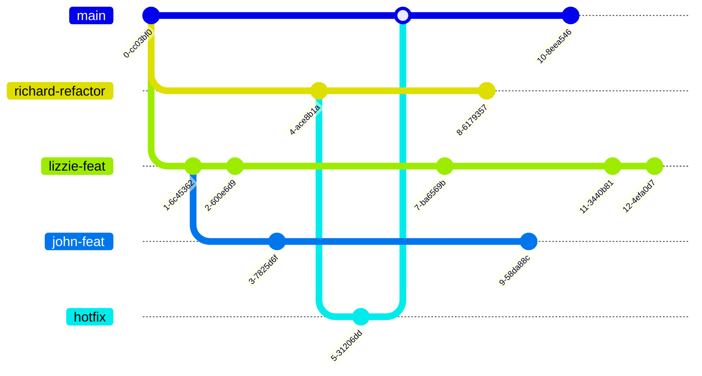

# Git in Practice  
## Techniques for Collaborative Development

---
hideInToc: true
--- 
## Contents
<!-- <Toc columns=2 maxDepth=1>
</Toc> -->

---
layout: cover
---

# Why Git Hurts in Teams

---
layout: two-cols
---

::left:: 


# The Solo Experience

<v-clicks>

 - Linear history
 - Zero conflicts
 - Total control 
</v-clicks>

::right:: 

<div v-click class="bg-white/5 p-4 rounded-lg shadow-xl">
<p class="text-xs mb-2 font-mono">This is what we expect</p>
<div class="scale-90 origin-top">


</div>
</div>

---
layout: default
---

# The Team Reality

<div class="grid grid-cols-3 gap-4">
<div class="col-span-1">

- You are 4 commits ahead
- John force-pushed his hotfix
- Richard's refactor has been approved
- Nobody has pulled in 3 days

</div>

<div v-click class="col-span-2 transition-all duration-500">

</div>
</div>

<div v-click class="absolute inset-0 flex items-center justify-center bg-red-900/80 backdrop-blur-sm rounded-lg border-4 border-red-500 animate-shake">
<div class="text-center">
  <carbon-warning-alt-filled class="text-6xl mb-2" />
  <h2 class="text-white">CONFLICT</h2>
  <p class="font-mono text-xs">CONFLICT (content): Merge conflict in EVERYTHING.ts</p>
</div>
</div>

---
layout: two-cols
---

::left:: 

<h2 class="mb-4">
Common Pain Points When Working in a Team
</h2>

<v-clicks>

- A messy, unreadable commit history
- Long-lived branches that never merge cleanly
- Merge conflicts nobody understands
- Fear of breaking `main`
</v-clicks>

::right::

<div class="relative w-full">
  <div v-click v-show="$clicks <= 5" >
    <BadGitHistory />
  </div>
  <div v-click v-show="$clicks > 5" >
    <Merge />
  </div>
</div>

---
layout: default
class:
---

# Sounds familiar?

<SoundsFamiliar/>

---
layout: cover
---

# How Git Actually Works

<!-- commmit as a change set (not strictly true, but makes things simple) -->


---
src: ./pages/commit.md
---

---

<div class="h-full flex justify-center items-center scale-300">


</div>

---

<div class="grid grid-cols-2 gap-6">
<div>


<h2 class="mb-4">Branches Are Just Pointers</h2>
<v-clicks>

- A branch is just an extra piece of metadata that gets passed along from parent to child 
- No copies, no magic 
- Multiple branches can point to the same commit

</v-clicks>
</div>

<div>
<div v-click>


</div>
<div v-click>


</div>

</div>
</div>

<!-- branches arent folders -->

---

## Squashing Strategies
- Squash before merge
- Squash during rebase 
- Squash in GitHub/GitLab
- Just dont squash
<!-- Sam: if commits just undo previous commits then would squash  
Telling the useful story -->


---
layout: cover
---

# Conflicts Happen 
## Don't panic

---
layout: default
---

# Creation of a conflict

<Conflicts />

---
layout: default
---

# The Best Way to Prevent Conflicts
<p class="opacity-50 -mt-2 mb-8">Stop them from happening in the first place</p>

<div class="grid grid-cols-3 gap-4">

<div v-click class="p-4 rounded-xl border border-blue-500/20 bg-blue-500/5 shadow-lg">
  
<h3 class="font-bold mb-1 flex items-center"> <carbon-paint-brush class="text-blue-400 text-3xl mb-1 mr-2" />Consistency</h3>

- Have a standard:
  - quotation marks
  - indentation
  - white space
  - import order
  - variable names
  - ...

</div>

<div v-click class="p-4 rounded-xl border border-green-500/20 bg-green-500/5 shadow-lg">
  
<h3 class="font-bold mb-1 flex items-center"> <carbon-bot class="text-green-400 text-3xl mb-1 mr-2" />Automation</h3>

- Enforce some standards using linters

```js
//from eslint.config
stylistic: {
  indent: 2,
  quotes: 'single',
},
```

- The diff will only show logic changes
- Enforce those linters with git-hooks or CI/CD pipelines

</div>

<div v-click class="p-4 rounded-xl border border-purple-500/20 bg-purple-500/5 shadow-lg">

<h3 class="font-bold mb-1 flex items-center">
<carbon-chat class="text-purple-400 text-3xl mb-1 mr-2" />
 Teamwork</h3>

- **Communicate**
- Small, atomic PRs
- Culture changes:
  - `git pull` and `git rebase` frequently
  - `git fetch` is a friend 

</div>
</div>

---

## Tools that can help resolve conflicts

- IDE merge tools 
- `git mergetool`

---
layout: cover
---

# Git Power Tools and How to Use Them
## Without Breaking Things

---

## `git reset`
- `--soft`
etc 
- which bits move (HEAD Index Workign Tree) Make sure that these are defined

---

## `git reflog`

---

## `git cherry-pick`
- Apply a specific commit elsewhere
- Great for quick fix
- Dangerous when overused

---

## `git rebase`
-- Applying lots of cherry-picks at once 

---

## `git bisect`
- underused! 
  
---

# Shaping History Intentionally

## Branching, Merging, Rebasing

---

## Merge: Preserving History

- Keeps all branches visible
- Shows when work diverged
- Can create noisy graphs

<!-- Diagram slide -->

---

## Rebase: Rewriting History

- Replays commits on a new base
- Creates linear history
- Changes commit hashes

<!-- Diagram slide -->

---

## Rebase vs Merge

- Merge: record *what happened*
- Rebase: show *what you want others to see*

> Rebase your own work.  
> Merge shared work.

---

## Interactive Rebase

- Reorder commits
- Squash commits
- Edit commit messages

---


# How Teams Organize Change
## Collaboration Workflows

- Depends very much on numerous things: 
  - Infrastructure vs software 
  - Length of time it takes for CI to run 

---

## Using remotes
- Initially (before gitlab github) everyone would have their own remote
- Push and pull to each others
- Where the term "pull request" came from. 

---

## Feature Branch Workflow

- One branch per change
- Pull / merge requests
- Pros: isolation, review
- Cons: long-lived branches

---

## Trunk-Based Development

- Short-lived branches
- Frequent integration
- Heavy use of CI
- Pros: fewer conflicts
- Cons: requires discipline

---

## Gitflow (Briefly)

- `develop`, `release`, `hotfix`
- Popular historically
- Often too heavy 
- Designed to solve problems that are not so big anymore 
<!-- Releases used to be ~2 years, now two weeks ish (the problem that it was designed to fix) -->

---

## Pull Requests Fit *On Top*

- PRs are a collaboration layer
- Not a workflow by themselves
- History quality affects review quality

---


# Scaling beyond the individual
## Automation and Reviews 

---

## Git Hooks 
- pre-commit 
- commit-msg

---

## CI/CD Integration
- Tests on every push 
- As enforcement  

---

## Code Reviews
- Small MR/PRs 
- Clear intent 
- History cear 

---

# Exercise overview 
WHATEVER THIS MAY BE

---


# Practical Rules to take away 
- Rebase your own 
- Merge together
- Keep PRs small
- Write (published) commits for everyone else/future you

<!-- Git is a communication tool and its the history that tells the story -->
