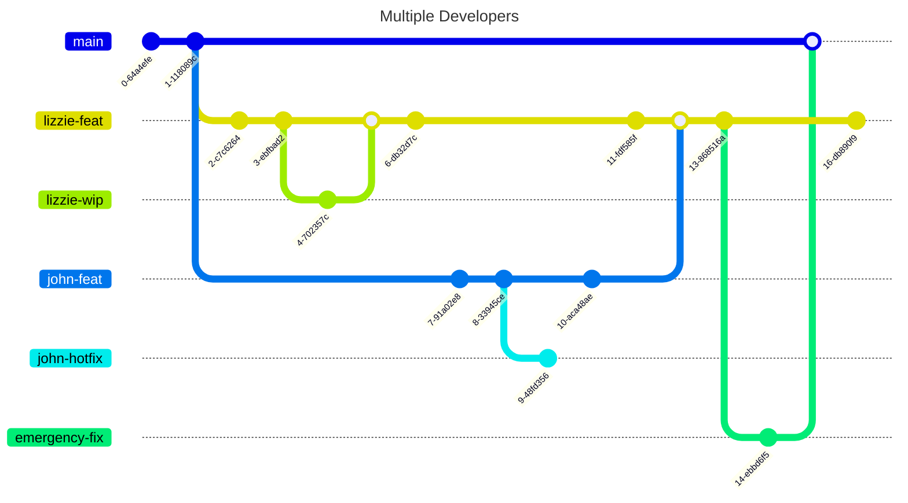

# Git in Practice  
## Techniques for Collaborative Development

Control • Confidence • Collaboration

---
hideInToc: true
--- 
## Contents
<Toc columns=2>
</Toc>

---
layout: two-cols
---

<template v-slot:default>

# Why Git Hurts in Teams

“Git is easy alone, hard together”

- Works great on solo projects


- Becomes painful with multiple developers

</template>
<template v-slot:right>


</template>
---

## Common Pain Points

- Messy, unreadable commit history
- Long-lived branches that never merge cleanly
- Merge conflicts nobody understands
- Fear of breaking `main`

---

## What This Talk Is About

- Not Memorizing commands
- Not Git internals trivia
- Learning how to work as a team *safely*

---

# How Git Actually Works

## (Mental Model)

<!-- This section is non-negotiable -->

---

## Commits Are the Core Unit

- A commit is a snapshot
- Each commit points to a parent
- History forms a **graph**, not a line

<!-- Diagram slide -->

---

## Branches Are Just Pointers

- A branch = movable label
- No copies, no magic
- Multiple branches can point to the same commit

---

## HEAD and Your Position

- `HEAD` = where you are now
- Detached HEAD explained briefly
- Why this matters for rebase/reset

---

## Why This Model Matters

- Explains merges and rebases
- Explains conflicts
- Explains “dangerous” commands

> Git only feels dangerous when the model is missing

---

# How Teams Organize Change

## Collaboration Workflows

---

## Feature Branch Workflow

- One branch per change
- Pull / merge requests
- Pros: isolation, review
- Cons: long-lived branches

---

## Trunk-Based Development

- Short-lived branches
- Frequent integration
- Heavy use of CI
- Pros: fewer conflicts
- Cons: requires discipline

---

## Gitflow (Briefly)

- `develop`, `release`, `hotfix`
- Popular historically
- Often too heavy today

<!-- Be opinionated but fair -->

---

## Pull Requests Fit *On Top*

- PRs are a collaboration layer
- Not a workflow by themselves
- History quality affects review quality

> Your workflow determines your pain.

---

# Shaping History Intentionally

## Branching, Merging, Rebasing

> Git history is nothing but air

<!-- Technical core -->

---

## Merge: Preserving History

- Keeps all branches visible
- Shows when work diverged
- Can create noisy graphs

<!-- Diagram slide -->

---

## Rebase: Rewriting History

- Replays commits on a new base
- Creates linear history
- Changes commit hashes

<!-- Diagram slide -->

---

## Rebase vs Merge

- Merge: record *what happened*
- Rebase: show *what you want others to see*

> Rebase your own work.  
> Merge shared work.

---

## Interactive Rebase

- Reorder commits
- Squash commits
- Edit commit messages

```bash
git rebase -i HEAD~5
